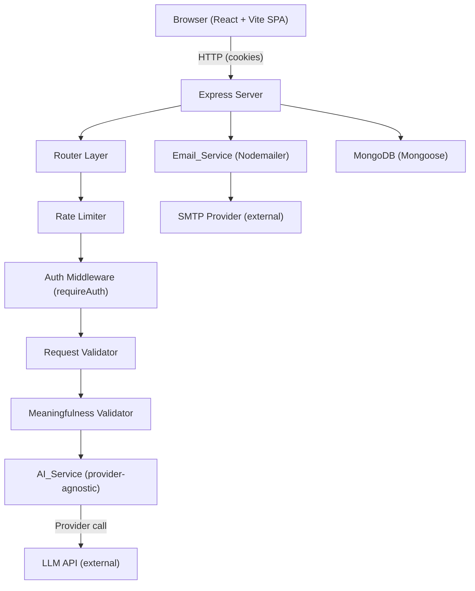
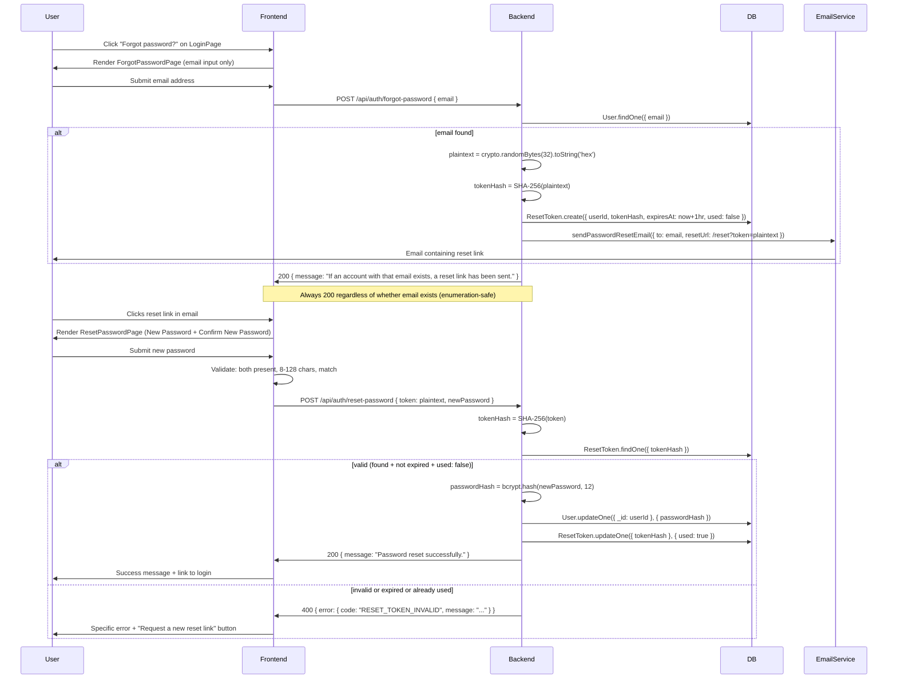

# Design Document — Relate
## Overview

Relate is a full-stack web application that helps users understand difficult or abstract concepts by explaining them through familiar analogies. A user enters a Concept (a word, phrase, question, paragraph, or explanation of any subject they want to understand), selects an Analogy_World (a familiar domain such as "Restaurant", "Sports", or "Movies"), and the system generates a structured, AI-powered analogy that maps Concept elements to elements of the chosen world.

The generated output comprises:
- A **Visual_Model** — a flowchart/mental model diagram rendered with React Flow and Dagre, showing Analogy_Nodes and Analogy_Relationships.
- An **Explanation** — a written narrative describing the analogy and how it maps to the Concept.
- **Limitations** — specific points where the analogy diverges from or misrepresents the Concept.

Authenticated users can save analogies to a personal Library and enter Practice Mode, where AI-generated questions test their understanding of a specific saved analogy. Practice history is preserved so users can review past sessions and generate additional questions over time.

**Guest-first model:** Users can generate and fully view one Analogy without creating an account. The one-free-analogy limit is enforced by the Backend using a persistent Guest_ID cookie — the Frontend is not the enforcement point.

**Key design principles:**
- **Provider-agnostic AI:** The AI_Service accepts a structured request and returns a validated AI_Response. The specific LLM provider is configured via environment variables and can be replaced without touching the Frontend or other Backend routes.
- **Structured JSON output:** All AI responses are validated against defined schemas before being passed downstream. Retries are applied on validation failure.
- **Validated round-trip:** AI_Response data is parsed, validated, serialized to UTF-8 JSON, stored, deserialized, and validated again before delivery to the Frontend. All fields — including Analogy_Title — must survive the round-trip exactly.
- **Secrets server-side only:** LLM_API keys and other credentials never appear in any response sent to the Frontend, in logs, or in source code. The server refuses to start if required environment variables are absent.
- **Graceful degradation:** AI failures return structured error responses. The Frontend re-enables controls and provides actionable retry paths rather than leaving users in broken states.
- **Practice as a first-class feature:** Practice Mode has dedicated routes, components, and data models. Historical sessions are stored in full so review requires no new AI calls.

---

## Visual Design Direction

Relate's visual identity is playful, hand-crafted, and sketchbook-like — warm, tactile, and imperfect rather than sterile. The design evokes hand-drawn annotations, paper or card surfaces, subtle imperfections, doodles, underlines, stars, arrows, stamps, and sketches. The visual style is cohesive across the entire application and distinctive — not generic dashboard styling.

The design remains readable and accessible and does not sacrifice usability for decoration.

### World-Aware Visual Model

The Visual_Model's appearance is controlled by the selected Analogy_World. Each world influences the visual treatment of nodes, edges, and surrounding decorative elements.

**Architecture:**

Analogy_World ? world-theme resolver ? VisualModel ? custom AnalogyNode / edge / decorative treatment

**CONTENT vs PRESENTATION:**

CONTENT (semantic, from AI_Response, stored in MongoDB):
- conceptLabel
- analogyLabel
- relationships (sourceId, targetId, label, flow)
- explanation
- limitations

PRESENTATION (determined at render time by the Frontend, never stored):
- colors
- node surface styling
- border treatment
- shape
- icon/motif
- decorative details
- edge styling
- background decoration
- world-specific visual accents

**Implementation requirements:**
- Every Visual_Model receives `analogyWorld` as a prop
- `analogyWorld` is resolved to a frontend visual theme configuration
- The theme controls presentation only — semantic AI data remains generic
- Custom React Flow nodes are responsible for the world-aware node appearance
- The Visual Model may also apply world-aware edge styling and subtle surrounding decorative elements
- The selected world should be visually recognizable without requiring the user to read the world name
- The theme enhances the analogy rather than obscuring the concept/analogy labels
- The graph remains usable with 3–20 nodes
- Dagre still computes positions at render time
- No positions or presentation state are stored in MongoDB
- A fallback generic Relate theme exists for any backend world that does not have a dedicated visual theme

**World theme examples (not exhaustive):**
- City/urban world ? city/architecture/road/map-inspired visual details
- Kitchen/restaurant world ? recipe-card, utensil, ingredient, menu or kitchen-inspired details
- Space world ? planets, stars, spacecraft/orbit-inspired details
- Nature world ? leaves, organic shapes, botanical details
- Factory world ? machine/blueprint/industrial-inspired details
- Library/knowledge world ? books, paper, archive/knowledge-inspired details

These are examples of the visual direction — the system is not hardcoded to these specific world names.

---

## UI Visual Specification

This section is the authoritative reference for all visual implementation decisions. Every token, layout rule, and component specification below derives directly from the application mockup. Developers must follow this section to produce a consistent, shippable UI.

---

### 1. Color Tokens

| Token name | Hex value | Usage |
|---|---|---|
| `--color-bg-page` | `#F5F0E8` | Page background, canvas background |
| `--color-bg-card` | `#FFFFFF` | Card surfaces, input fields, modal backgrounds |
| `--color-bg-card-warm` | `#FAF7F2` | Slightly warmer card variant (auth cards, world selector cards) |
| `--color-accent-primary` | `#5B4FCF` | Primary buttons, active nav items, world badges, focus rings, CTA elements, purple text highlights |
| `--color-accent-primary-hover` | `#4A3FB8` | Hover state for primary accent elements |
| `--color-accent-secondary` | `#F5C842` | Stars, highlight accents, loading state decorations, warning indicators |
| `--color-text-primary` | `#1A1A2E` | All body text, headings, labels, node content |
| `--color-text-secondary` | `#6B6B8A` | Metadata, placeholders, secondary labels, dates, subheadings |
| `--color-text-on-accent` | `#FFFFFF` | Text on filled purple or colored buttons/badges |
| `--color-success` | `#4CAF50` | Correct answer state — card background tint, border, checkmark icon |
| `--color-success-bg` | `#F0FBF0` | Correct answer card background fill |
| `--color-error` | `#E53935` | Incorrect answer state — card background tint, border, validation errors |
| `--color-error-bg` | `#FFF0F0` | Incorrect answer card background fill |
| `--color-border-default` | `#D8D0C4` | Default card borders, input borders — warm gray, slightly irregular appearance |
| `--color-border-focus` | `#5B4FCF` | Input focus border, selected card border |
| `--color-border-subtle` | `#EDE8DF` | Dividers, subtle separators |
| `--color-shadow` | `rgba(26,26,46,0.08)` | Card drop shadows |

**Usage rules:**
- Never use pure `#000000` or `#FFFFFF` for page surfaces — always use the warm token values.
- The purple accent (`#5B4FCF`) is the single interactive color. All interactive affordances (buttons, links, selected states) use it.
- Yellow (`#F5C842`) is decorative only — never use it as a primary interactive color.
- Success/error states are restricted to Practice Mode answer feedback and form validation.

---

### 2. Typography Scale

All font sizes are in `rem` relative to a `16px` base.

| Role | Size | Weight | Style | Usage |
|---|---|---|---|---|
| Logo / Wordmark | 1.75rem (28px) | — | Handwritten script font (e.g. Caveat, Kalam, or similar) | Relate logo in navbar and auth cards |
| H1 — Hero heading | 2.5rem (40px) | 800 | Chunky sans-serif, dark | Landing page hero title |
| H1 — Page heading | 1.75rem (28px) | 700 | Sans-serif, dark | Page titles (Library, Practice) |
| H2 — Section heading | 1.25rem (20px) | 700 | Sans-serif, dark | Card section titles, panel headings |
| H3 — Card title | 1.125rem (18px) | 600 | Sans-serif, dark | AnalogyCard title, form step labels |
| Body — Regular | 1rem (16px) | 400 | Sans-serif | Explanation prose, general content |
| Body — Small | 0.875rem (14px) | 400 | Sans-serif | Secondary descriptions, button labels |
| Meta / Label | 0.75rem (12px) | 400 | Sans-serif, `--color-text-secondary` | Dates, node concept label, character counter, footnotes |
| Node — Analogy label | 0.875rem (14px) | 700 | Sans-serif, `--color-text-primary` | Primary label inside AnalogyNode (bottom line) |
| Node — Concept label | 0.6875rem (11px) | 400 | Sans-serif, `--color-text-secondary` | Secondary label inside AnalogyNode (top line) |
| Badge / Pill | 0.75rem (12px) | 600 | Sans-serif, uppercase tracking | World badges, tag pills |

**Decorative heading treatment:**
- The hero heading word "differently." and section headings that carry emphasis use the same handwritten script font as the logo — purple, italic.
- Hand-drawn underlines appear beneath H1 and H2 headings on landing and auth pages. Implement as an SVG underline or a CSS `border-bottom` with a sketchy brush-stroke background image.

---

### 3. Spacing and Layout

#### Breakpoints

| Name | Range | Layout behavior |
|---|---|---|
| Mobile | < 768px | Single column, no sidebar, bottom navigation bar, Visual Model horizontally scrollable |
| Tablet | 768px – 1023px | Sidebar collapses to icon-only or hidden, 2-column library grid |
| Desktop | = 1024px | Full sidebar (~240px), 3-column library grid, 2-column result view |

#### Spacing scale (multiples of 4px)

| Token | Value | Common use |
|---|---|---|
| `--space-1` | 4px | Icon padding, tight gaps |
| `--space-2` | 8px | Inner label padding, small gaps |
| `--space-3` | 12px | Button padding (vertical) |
| `--space-4` | 16px | Standard element gap, card padding (inner) |
| `--space-5` | 20px | Section gap |
| `--space-6` | 24px | Card padding, section margin |
| `--space-8` | 32px | Large section spacing |
| `--space-12` | 48px | Hero section vertical padding |
| `--space-16` | 64px | Hero top/bottom padding |

#### Layout regions

**Sidebar (authenticated, desktop):**
- Width: 240px, fixed
- Background: `--color-bg-card-warm`
- Border-right: 1px solid `--color-border-subtle`
- Contains: logo, nav links, user identity at bottom

**Main content area (authenticated, desktop):**
- Left margin: 240px (sidebar width)
- Padding: 32px horizontal, 32px top

**Result view (desktop):**
- Two-column split within main content
- Left column (Visual_Model canvas): ~60% of available width
- Right column (Explanation/controls panel): ~40%, scrollable independently
- The two columns share full viewport height minus the top toolbar

**Centered guest layout:**
- Max-width: 680px for ConceptForm steps
- Max-width: 420px for auth cards
- Horizontally centered with `margin: 0 auto`
- Vertical padding: `--space-16` top, `--space-12` bottom

---

### 4. Component Visual Specifications

#### Navbar (guest / unauthenticated)

- Full-width, sticky top, height 64px
- Background: `--color-bg-page` (transparent on landing, opaque on scroll)
- Left: Relate logo (wordmark, handwritten script, purple)
- Right: "Log in" ghost button + "Sign up" filled primary button (only for guest flow)
- No navigation links visible for unauthenticated users on landing page

#### Sidebar (authenticated, desktop)

- Width: 240px, full viewport height
- Background: `--color-bg-card-warm`
- Top: Relate logo, same treatment as Navbar
- Nav items: vertical list, 48px row height each
  - Icon (24px) + label, left-aligned, `--space-4` horizontal padding
  - Default state: `--color-text-secondary` icon and label
  - Active state: `--color-accent-primary` icon and label, light purple background fill (`rgba(91,79,207,0.08)`) on the row, rounded corners (6px)
  - Items: Explore (compass/home icon), My Library (bookmark), Practice (star/graduation cap), History (clock), Settings (gear), Help (question mark)
- Bottom: User avatar (32px circle, initial letter) + name + "View profile" link — `--color-text-secondary`, small meta size

#### Bottom Navigation Bar (mobile only)

- Fixed bottom, full width, height 56px
- Background: `--color-bg-card`, border-top: 1px solid `--color-border-subtle`
- 4 items evenly spaced: Explore (house), My Library (bookmark), Practice (star/book), Profile (person)
- Active item: purple icon + label, pill-shaped indicator or underline
- Inactive item: `--color-text-secondary` icon, no label or small label

#### ConceptForm (step 2 — guest input)

- Centered card, max-width 680px
- Step indicator at top: numbered circles (1, 2), active step filled purple, inactive outlined
- Heading "What do you want to understand?" with hand-drawn underline
- Textarea:
  - Min-height: 120px, max-height: 240px, resizable vertically
  - Background: `--color-bg-card-warm`
  - Border: 1.5px solid `--color-border-default`, border-radius 10px
  - Font: body regular, `--color-text-primary`
  - Placeholder: `--color-text-secondary`
  - Focus: border-color `--color-border-focus`, box-shadow `0 0 0 3px rgba(91,79,207,0.12)`
  - Character counter bottom-right: `{count} / 240` in meta font, `--color-text-secondary`
- Below textarea: "Try these examples" row of chip buttons
  - Each chip: `--color-bg-card-warm` background, `--color-border-default` border, body-small font, border-radius 20px, `--space-2` vertical padding, `--space-4` horizontal padding
  - Hover: purple border, purple text
- Footer note: "You get 1 free analogy. Create an account to save and practice!" — meta font, centered, `--color-text-secondary`

#### WorldSelector

- Grid layout: 3 columns on desktop, 2 on tablet, 2 on mobile
- Each world card:
  - Background: `--color-bg-card-warm`
  - Border: 1.5px solid `--color-border-default`, border-radius 12px
  - Padding: `--space-4`
  - Content: illustrated icon (32px, world-specific — see World Theme Tokens), world name (H3), brief description (meta font, `--color-text-secondary`)
  - Default state: `--color-border-default` border, `--color-bg-card-warm` background
  - Selected state: `--color-border-focus` border (2px), background `rgba(91,79,207,0.06)`, world icon color intensified
  - Hover state: `--color-border-focus` border at 1.5px
- Transition: border-color and background-color 150ms ease

#### VisualModel Canvas

- Fills its column (60% of desktop result view, full width on mobile)
- Background: `--color-bg-page` (warm cream), world-specific decorative overlay rendered as an SVG or CSS pattern layer beneath the React Flow graph
- React Flow instance:
  - `fitView` on initial load
  - Minimap: disabled on mobile, optional on desktop
  - Controls: zoom in/out + fit, bottom-left corner
  - Background: no React Flow built-in grid — the world-specific decoration serves as background
- Edges:
  - Type: `smoothstep` or custom bezier — not straight
  - Stroke: world accent color at 60% opacity, stroke-width 2px
  - Arrowhead: custom SVG marker, hand-drawn arrowhead style (slightly irregular triangle, not a sharp geometric arrow)
  - Animated: `animated: false` by default — no moving dash animation
- Node layout: Dagre computes at render time, top-to-bottom direction (`TB`), node separation 80px, rank separation 100px

#### AnalogyNode (custom React Flow node)

- Outer container: border-radius 10px, border 2px solid world accent color, background `--color-bg-card`, padding `--space-3` vertical `--space-4` horizontal, min-width 140px, max-width 200px
- Box shadow: `0 2px 8px rgba(26,26,46,0.10)`
- Top line — concept label: meta font (11px), `--color-text-secondary`, no bold, truncated with ellipsis if overflow
- Bottom line — analogy label: node analogy font (14px bold), `--color-text-primary`
- World accent icon: 14px icon in top-right corner of node, world-specific, `--color-text-secondary` tint
- Handle (React Flow connection handle): hidden (visual only — no user-draggable connections)
- Selected state (read-only, for emphasis): slightly stronger box shadow, accent color border brightened

#### LibraryGrid and AnalogyCard

**LibraryGrid:**
- 3-column CSS grid on desktop, 2 on tablet, 1 on mobile
- Gap: `--space-6`
- Search bar above grid: full width, `--color-bg-card` background, rounded 8px, `--color-border-default` border, search icon left

**AnalogyCard:**
- Background: `--color-bg-card`, border-radius 12px, border: 1px solid `--color-border-default`
- Box shadow: `0 2px 6px rgba(26,26,46,0.07)`
- Hover: shadow deepens to `0 4px 16px rgba(26,26,46,0.12)`, slight upward translate `translateY(-2px)`, transition 150ms
- Top thumbnail area: 80px height, background uses world accent color at 10% opacity, centered world icon at 28px — no actual graph rendering in thumbnails
- Card body padding: `--space-4`
  - Title: H3 font, `--color-text-primary`, 2-line clamp with ellipsis
  - World badge pill: immediately below title, see Badge spec
  - Node preview: 3–4 lines of `Concept ? Analogy` text, meta font, `--color-text-secondary`, line-clamp 4
  - Date: meta font, `--color-text-secondary`, bottom of body
- Card footer: `--space-4` padding, border-top `--color-border-subtle`, flex row
  - "Open" ghost button (left) + "Practice" ghost button (right)
  - Ghost button: transparent background, `--color-accent-primary` text, `--color-accent-primary` border at 1px, border-radius 6px, body-small font

**Empty state:**
- Centered illustration (empty bookshelf or open notebook — hand-drawn SVG)
- Heading: H2, dark
- Text: body regular, `--color-text-secondary`
- CTA: primary button

#### AuthForms (Login, Register, Forgot Password, Reset Password)

- Page: centered on `--color-bg-page`, full viewport height
- Card: max-width 420px, background `--color-bg-card-warm`, border-radius 16px, border 1.5px solid `--color-border-default`, padding 40px, box-shadow `0 4px 24px rgba(26,26,46,0.10)`
- Relate logo at top of card, centered, 28px
- Small decorative stars (?) in top-left and top-right corners of card, `--color-accent-secondary`, 12px
- Heading: H2 bold, `--color-text-primary`
- Subheading: body regular, `--color-text-secondary`
- Fields:
  - Label above input: body-small, `--color-text-primary`, font-weight 500
  - Input: full width, height 44px, background `--color-bg-card-warm`, border 1.5px solid `--color-border-default`, border-radius 8px, padding `--space-3` `--space-4`, body regular
  - Focus: border `--color-border-focus`, box-shadow `0 0 0 3px rgba(91,79,207,0.12)`
  - Error state: border `--color-error`, small error text below in error color, meta font
- Checkbox: native checkbox styled with accent color
- "Forgot password?" link: right-aligned, body-small, `--color-accent-primary`
- Primary button: full width (see Button spec)
- Footer link: centered, meta font, `--color-text-secondary` + inline `--color-accent-primary` link

#### PracticeQuestion

- Full-width content area within main panel, max-width 720px, centered
- Header: "Practice Question" label (meta, `--color-text-secondary`) + "Question X of Y" (body-small bold)
- Progress indicator: thin bar top of question area, fills proportionally with progress, `--color-accent-primary` fill
- Question text: H2 or large body (1.125rem), `--color-text-primary`, font-weight 600
- Margin below question: `--space-6`
- Answer option list: vertical stack, `--space-3` gap between options
- Navigation row at bottom: "Previous" ghost button (left) + "Next" / "Submit" primary button (right)

#### AnswerOption

- Row card: full width, min-height 52px, border-radius 10px, border 1.5px solid `--color-border-default`, background `--color-bg-card`, padding `--space-3` `--space-4`, flex row align-center
- Left: option letter badge — 28px circle, border 1.5px solid `--color-border-default`, body-small bold, `--color-text-secondary` — labels A, B, C, D
- Option text: body regular, `--color-text-primary`, flex 1, left padding `--space-4`
- Default hover: border `--color-border-focus` at 1.5px, badge border and text turn purple
- Selected (pre-submit): border `--color-accent-primary` 2px, background `rgba(91,79,207,0.05)`, badge filled purple with white text
- Correct (post-submit): border `--color-success` 2px, background `--color-success-bg`, badge filled green
- Incorrect (post-submit): border `--color-error` 2px, background `--color-error-bg`, badge filled red
- Transition: border-color, background-color 120ms ease
- "Not quite ?" label (incorrect): red text, meta font, shown above the options list
- "Correct! ?" label (correct): green text, meta font, with small ? star decoration in `--color-accent-secondary`

#### PracticeSessionSummary

- Score display: large centered number `80%`, H1 scale (2.5rem), bold, `--color-text-primary`
- Score sublabel: "X / Y correct", body regular, `--color-text-secondary`
- Score descriptor label: body-small, `--color-text-secondary` — e.g., "Worth another look"
- Decorative stars (?) scattered around score, `--color-accent-secondary`, various sizes 10–16px
- "You understood:" section heading (H3) + bullet list, `--color-success` bullet indicator
- "Worth another look:" section heading (H3) + bullet list, `--color-accent-secondary` bullet indicator
- Action buttons row: two side-by-side buttons
  - "Practice Again": ghost/secondary style
  - "Generate More Questions": filled primary style
- Margin between sections: `--space-8`

---

### 5. Button and Badge Specifications

#### Buttons

| Variant | Background | Text color | Border | Border-radius | Padding | Font |
|---|---|---|---|---|---|---|
| Primary | `#5B4FCF` | `#FFFFFF` | none | 8px | 12px 24px | body-small, bold |
| Primary full-width | `#5B4FCF` | `#FFFFFF` | none | 8px | 14px | body-small, bold |
| Ghost / secondary | transparent | `#5B4FCF` | 1.5px solid `#5B4FCF` | 8px | 10px 20px | body-small |
| Pill / modification | `--color-bg-card-warm` | `--color-text-primary` | 1px solid `--color-border-default` | 20px | 8px 16px | meta, regular |
| Icon button | `--color-bg-card-warm` | `--color-text-primary` | 1px solid `--color-border-default` | 50% | 8px | — |

- Primary hover: `--color-accent-primary-hover` background, no scale
- All buttons: `cursor: pointer`, `transition: background-color, border-color, box-shadow 150ms ease`
- Disabled state: 50% opacity, `cursor: not-allowed`
- Loading state: replace label with a small spinner (see Loading States); button width stays fixed to prevent layout shift

#### Badges / World Pills

- Background: world accent color (see World Theme Tokens)
- Text: `#FFFFFF`, badge font (12px, 600, uppercase tracking 0.04em)
- Border-radius: 20px (full pill)
- Padding: 2px 10px
- Each world has a distinct accent color for its badge (see section 6)

---

### 6. World Theme Tokens

Each world defines: accent color, badge color, node border color, icon description, and background decoration description. The `fallback` theme is used when no matching world is found.

#### City World

| Token | Value |
|---|---|
| `accent` | `#5B4FCF` (purple/indigo) |
| `nodeBorder` | `#5B4FCF` |
| `badgeBg` | `#5B4FCF` |
| `icon` | Small city buildings / skyline silhouette |
| `bgDecoration` | Road/street grid lines, small building silhouettes in corners, tree/park dot clusters — hand-drawn city map style |
| `edgeColor` | `#7B6FDF` |

#### Kitchen World

| Token | Value |
|---|---|
| `accent` | `#E07B39` (warm orange) |
| `nodeBorder` | `#E07B39` |
| `badgeBg` | `#E07B39` |
| `icon` | Fork and spoon crossed, or chef hat |
| `bgDecoration` | Recipe card ruled lines, utensil doodles (spoon, whisk, knife), ingredient label shapes |
| `edgeColor` | `#F0956A` |

#### Space World

| Token | Value |
|---|---|
| `accent` | `#2D3A8C` (deep blue/indigo) |
| `nodeBorder` | `#2D3A8C` |
| `badgeBg` | `#2D3A8C` |
| `icon` | Rocket ship or ringed planet |
| `bgDecoration` | Star field dots (small, scattered), planet outline circles, orbit ellipse rings, constellation lines |
| `edgeColor` | `#4A5AB0` |

#### Nature World

| Token | Value |
|---|---|
| `accent` | `#3A7D44` (forest green) |
| `nodeBorder` | `#3A7D44` |
| `badgeBg` | `#3A7D44` |
| `icon` | Leaf or plant sprout |
| `bgDecoration` | Leaf scatter shapes, organic flowing curves, botanical branch/stem motifs, small flower accents |
| `edgeColor` | `#5CA869` |

#### Factory World

| Token | Value |
|---|---|
| `accent` | `#7A7A7A` (steel gray) |
| `nodeSecondary` | `#F5C842` (amber highlight) |
| `nodeBorder` | `#7A7A7A` |
| `badgeBg` | `#555555` |
| `icon` | Gear / cog |
| `bgDecoration` | Blueprint-style grid lines (light blue tint on cream), gear outline shapes in corners, mechanical pipe/connector doodles |
| `edgeColor` | `#9A9A9A` |

#### Library World

| Token | Value |
|---|---|
| `accent` | `#7B5C2E` (warm brown) |
| `nodeSecondary` | `#C9A96E` (warm gold) |
| `nodeBorder` | `#7B5C2E` |
| `badgeBg` | `#7B5C2E` |
| `icon` | Open book |
| `bgDecoration` | Bookshelf line motifs, stacked book silhouettes, bookmark ribbon shapes, paper-fold corner accents |
| `edgeColor` | `#9A7A4A` |

#### Fallback / Generic Theme

| Token | Value |
|---|---|
| `accent` | `#5B4FCF` |
| `nodeBorder` | `#5B4FCF` |
| `badgeBg` | `#5B4FCF` |
| `icon` | Star / sparkle |
| `bgDecoration` | Minimal — small scattered stars and subtle dot pattern only |
| `edgeColor` | `#7B6FDF` |

**Implementation note:** World theme tokens are resolved at render time in a `worldThemes.js` config file. The theme object is passed as a prop to `VisualModel` and consumed by `AnalogyNode`, edge renderers, and the canvas background decorator component. Theme selection is case-insensitive string matching against world name.

---

### 7. Loading and Animation States

#### Generation Loading Screen

- Full page replacement (not an overlay modal)
- Background: `--color-bg-page`
- Centered content:
  - Relate logo top
  - Large heading: "Building your analogy world..." — H1, `--color-accent-primary` for key words
  - Animated ? stars: 3–5 stars, `--color-accent-secondary`, scattered around the heading
  - Star animation: each star fades in/out and slightly scales (0.8?1.2) on a staggered 400ms cycle — CSS keyframe animation, no JS required
- No progress bar (indeterminate duration)
- Do not show a spinner — use the star animation exclusively to maintain brand consistency

#### Button Loading State

- Replace button label text with a small inline spinner (16px, white, border-style CSS spinner)
- Button stays at exact same width and height — no layout shift
- Button is `disabled` + `cursor: not-allowed` during loading
- Applies to: "Make the connection ?", "Log in ?", "Create account ?", any action that triggers a network request

#### Page Transitions

- Route changes: 150ms fade-in on new page content (`opacity: 0 ? 1`)
- Card hover transitions: 150ms ease for shadow and transform
- Answer option state transitions: 120ms ease for color/background changes

---

### 8. Mobile and Responsive Rules

#### Mobile layout (< 768px)

- Sidebar: hidden entirely
- Bottom nav bar: visible and fixed (see BottomNav spec in section 4)
- Navbar top bar: retained, logo only (no action buttons except hamburger if needed)
- Landing hero: single column, illustration moves below the text (or hides)
- ConceptForm: full-width, `--space-4` horizontal padding
- WorldSelector: 2-column grid
- Result view: Visual_Model canvas is full width, fixed height 320px, horizontally pannable (React Flow panning enabled, pinch-zoom enabled); Explanation panel scrolls below the canvas
- LibraryGrid: 1-column
- Practice questions: single column, answer options full width

#### Tablet layout (768–1023px)

- Sidebar: collapses to 60px icon-only strip (icons remain, labels hidden)
- LibraryGrid: 2 columns
- Result view: stacked (Visual_Model on top, Explanation panel below) — same as mobile result layout but with wider canvas

#### Desktop layout (= 1024px)

- Full sidebar (240px)
- LibraryGrid: 3 columns
- Result view: 60/40 side-by-side split
- ConceptForm: centered, max-width 680px

---

### 9. Decorative Language Rules

These rules govern where and how the hand-crafted visual elements appear. Inconsistent use breaks the brand language; overuse makes the UI feel cluttered.

**Stars (? / ?):**
- Appear near H1 and H2 headings on the landing page, auth card corners, practice score display, and correct answer feedback
- Size range: 10–16px
- Color: always `--color-accent-secondary` (#F5C842) except on the loading screen where they may be larger (20–28px)
- Placement: 1–3 stars per context, slightly offset from the content they accent — never in a straight line
- Do NOT use stars inside body text, inside cards (except auth card corners), or in navigation

**Hand-drawn underlines:**
- Used beneath H1 on the landing page and H2 headings on ConceptForm steps and auth screens
- Implement as a separate `<span>` with a background SVG underline image, or as an absolutely positioned `<svg>` element beneath the heading
- Style: single wavy or slightly irregular stroke, `--color-accent-primary` color, 2–3px stroke, extends slightly beyond the text
- Do NOT use under every heading — reserved for page-level titles and the main CTA heading

**Decorative arrows and directional doodles:**
- Used sparingly on the landing page to guide eye flow toward the CTA
- Style: curved, hand-drawn SVG, `--color-text-secondary` color, 1.5px stroke
- Do NOT appear in the authenticated app (library, practice, result pages)

**Rough / irregular borders:**
- Card borders are `--color-border-default` but should feel slightly warm and organic, not pixel-perfect
- Achieve this with `border-radius` values that are intentionally asymmetric if using SVG outlines, or simply by using the warm border color against the warm background — not by applying heavy CSS filter effects
- Input fields and primary cards use standard CSS borders; the "roughness" comes from color warmth and context, not from actual irregular geometry

**World canvas decorations:**
- Each world's background decoration is rendered as a non-interactive SVG layer behind the React Flow graph
- Opacity: 0.12–0.20 — subtle enough to not interfere with node readability
- Decorations are static (no animation) and do not respond to graph interactions
- Decorations respect the canvas bounds and do not extend outside the VisualModel container

**General restraint rule:** Any single screen should contain at most two types of decorative elements active simultaneously. The decorative language supports the content — it does not compete with it.

---

## Architecture

### System Components



### Analogy Generation Request Flow

```
1. Frontend  ?  POST /api/analogies/generate { concept, analogyWorld }
2. Express   ?  RateLimiter
               ? IP for unauthenticated requests
                ? userId for authenticated requests
3. Express   ?  Validator (schema check, sanitize)
4. Express   ?  MeaningfulnessValidator.validate(concept)
                  ? if invalid  ?  400 { code: MEANINGFULNESS_REJECTED, message }  (AI not called)
5. Express   ?  AIService.generate({ concept, analogyWorld })
                  ? LLM call (30s timeout, up to 2 retries on validation failure)
                  ? validateAIResponse(response)
6. Express   ?  GuestUsage check (if unauthenticated)
                  ? if consumed  ?  403
                  ? if not consumed  ?  mark consumed, store analogyData
7. Express   ?  200 { analogy: AI_Response }
```

### Practice Question Generation Request Flow

```
1. Frontend  ?  POST /api/practice/questions { analogyId, ...analogyContext }
2. Express   ?  requireAuth
3. Express   ?  RateLimiter (per userId)
4. Express   ?  Validator
5. Express   ?  AIService.generatePracticeQuestions({ concept, analogyWorld, nodes,
                  mappings, relationships, explanation, limitations,
                  questionCount, previousQuestions })
                  ? LLM call (15s timeout, up to 2 retries)
                  ? validatePracticeQuestions(response)
6. Express   ?  200 { questions: PracticeQuestion[] }
```

---

## Project Structure

```
relate/
+-- client/                          # React + Vite SPA
¦   +-- index.html
¦   +-- vite.config.js
¦   +-- src/
¦       +-- api/                     # Axios/fetch wrappers per domain
¦       ¦   +-- auth.api.js
¦       ¦   +-- analogy.api.js
¦       ¦   +-- library.api.js
¦       ¦   +-- practice.api.js
¦       ¦   +-- worlds.api.js
¦       +-- components/
¦       ¦   +-- layout/
¦       ¦   ¦   +-- Navbar.jsx
¦       ¦   ¦   +-- ProtectedRoute.jsx
¦       ¦   ¦   +-- GuestRoute.jsx
¦       ¦   +-- analogy/
¦       ¦   ¦   +-- ConceptForm.jsx
¦       ¦   ¦   +-- WorldSelector.jsx
¦       ¦   ¦   +-- VisualModel.jsx
¦       ¦   ¦   +-- AnalogyNode.jsx       # Custom React Flow node component
¦       ¦   ¦   +-- ExplanationPanel.jsx
¦       ¦   ¦   +-- LimitationsPanel.jsx
¦       ¦   ¦   +-- ModificationControls.jsx
¦       ¦   ¦   +-- GuestPrompt.jsx
¦       ¦   +-- practice/
¦       ¦   ¦   +-- PracticeLanding.jsx
¦       ¦   ¦   +-- PracticeAnalogySelector.jsx
¦       ¦   ¦   +-- PracticeQuestion.jsx
¦       ¦   ¦   +-- MultipleChoiceInput.jsx
¦       ¦   ¦   +-- AnswerOption.jsx
¦       ¦   ¦   +-- ShortAnswerInput.jsx
¦       ¦   ¦   +-- EvaluationFeedback.jsx
¦       ¦   ¦   +-- ExplanationDropdown.jsx
¦       ¦   ¦   +-- MappingReference.jsx
¦       ¦   ¦   +-- PracticeSessionSummary.jsx
¦       ¦   ¦   +-- PracticeHistory.jsx
¦       ¦   ¦   +-- PracticeHistoryCard.jsx
¦       ¦   ¦   +-- PracticeSessionReview.jsx
¦       ¦   +-- library/
¦       ¦   ¦   +-- LibraryGrid.jsx
¦       ¦   ¦   +-- AnalogyCard.jsx
¦       ¦   +-- ui/
¦       ¦       +-- InlineError.jsx
¦       ¦       +-- LoadingSpinner.jsx
¦       ¦       +-- EmptyState.jsx
¦       ¦       +-- BannerError.jsx
¦       +-- pages/
¦       ¦   +-- HomePage.jsx
¦       ¦   +-- AnalogyPage.jsx              # fresh generation AND saved analogy view
¦       ¦   +-- LibraryPage.jsx
¦       ¦   +-- PracticeLandingPage.jsx
¦       ¦   +-- PracticeSessionPage.jsx
¦       ¦   +-- PracticeHistoryPage.jsx
¦       ¦   +-- PracticeSessionReviewPage.jsx
¦       ¦   +-- LoginPage.jsx
¦       ¦   +-- RegisterPage.jsx
¦       ¦   +-- ForgotPasswordPage.jsx
¦       ¦   +-- ResetPasswordPage.jsx
¦       +-- hooks/
¦       ¦   +-- useAuth.js               # reads AuthContext
¦       ¦   +-- useAnalogy.js            # analogy generation + modification state
¦       ¦   +-- useGuestSession.js       # sessionStorage "guestAnalogy" key
¦       ¦   +-- usePractice.js           # practice session state machine
¦       +-- context/
¦       ¦   +-- AuthContext.jsx          # user, loading, login(), logout()
¦       +-- utils/
¦           +-- dagre.js                 # applyDagreLayout(nodes, edges)
¦           +-- truncate.js              # truncate(str, maxLen) ? str + ellipsis
¦           +-- guestSession.js          # get/set/clear sessionStorage["guestAnalogy"]
+-- server/
    +-- .env.example
    +-- package.json
    +-- src/
        +-- config/
        ¦   +-- env.js               # validates required env vars at startup, exports config
        ¦   +-- worlds.js            # Analogy_World_List — configurable, not hardcoded
        ¦   +-- practice.js          # PRACTICE_QUESTION_COUNT, timeouts, max retries
        +-- routes/
        ¦   +-- auth.routes.js
        ¦   +-- analogy.routes.js
        ¦   +-- library.routes.js
        ¦   +-- practice.routes.js
        ¦   +-- worlds.routes.js
        +-- controllers/
        ¦   +-- auth.controller.js
        ¦   +-- analogy.controller.js
        ¦   +-- library.controller.js
        ¦   +-- practice.controller.js
        +-- middleware/
        ¦   +-- auth.middleware.js    # requireAuth: reads cookie, verifies JWT
        ¦   +-- rateLimiter.js        # per-endpoint rate limit configs
        ¦   +-- validate.middleware.js
        +-- models/
        ¦   +-- User.model.js
        ¦   +-- Analogy.model.js
        ¦   +-- PracticeSession.model.js
        ¦   +-- GuestUsage.model.js
        ¦   +-- ResetToken.model.js
        +-- services/
            +-- ai/
            ¦   +-- aiService.js              # provider-agnostic facade
            ¦   +-- meaningfulnessValidator.js # isolated module
            ¦   +-- providers/
            ¦   ¦   +-- groq.provider.js
            ¦   ¦   +-- index.js              # getProvider() resolves from LLM_PROVIDER env
            ¦   +-- prompts/
            ¦   ¦   +-- generate.prompt.js
            ¦   ¦   +-- simplify.prompt.js
            ¦   ¦   +-- expand.prompt.js
            ¦   ¦   +-- regenerate.prompt.js
            ¦   ¦   +-- switchWorld.prompt.js      # [Req 5.5] Different Analogy_World modification
            ¦   ¦   +-- practiceQuestions.prompt.js
            ¦   ¦   +-- practiceEvaluate.prompt.js
            ¦   ¦   +-- generateMoreQuestions.prompt.js
            ¦   ¦   +-- meaningfulness.prompt.js
            ¦   +-- validators/
            ¦       +-- aiResponse.validator.js
            ¦       +-- practiceQuestions.validator.js
            ¦       +-- practiceEvaluation.validator.js
            +-- email/
            ¦   +-- email.service.js
            +-- token.service.js             # crypto.randomBytes, SHA-256 hashing
```

---

## Components and Interfaces

### AI_Service Interface

```js
/**
 * Generate a new analogy or a modified version of an existing one.
 *
 * @param {Object} request
 * @param {string} request.concept              - User's Concept (1-5000 chars)
 * @param {string} request.analogyWorld         - Selected Analogy_World name
 * @param {'generate'|'simplify'|'expand'|'regenerate'|'switch world'} [request.modificationType]
 * @param {number} [request.currentNodeCount]   - Required for simplify/expand
 * @param {string} [request.newAnalogyWorld]     - Required for switchWorld
 * @param {string} [request.previousAnalogyWorld] - Required for switchWorld
 * @param {string[]} [request.previousNodeLabels] - Required for regenerate (force diff)
 * @returns {Promise<AI_Response>}              - Validated AI_Response object
 */
async function generate(request) {}

/**
 * Determine whether a Concept is meaningful enough for analogy generation.
 * Isolated module — changing the validation mechanism does not affect other services.
 *
 * @param {string} concept
 * @returns {Promise<{ valid: boolean, reason: string, message: string }>}
 */
async function validateMeaningfulness(concept) {}

/**
 * Generate practice questions for a specific analogy.
 *
 * @param {Object} request
 * @param {string} request.concept
 * @param {string} request.analogyWorld
 * @param {AnalogyNode[]} request.nodes
 * @param {AnalogyMapping[]} request.mappings
 * @param {AnalogyRelationship[]} request.relationships
 * @param {string} request.explanation
 * @param {string[]} request.limitations
 * @param {number} request.questionCount         - Max questions (1-5)
 * @param {string[]} [request.previousQuestions] - Texts of previously asked questions
 *                                                 (used by Generate More Questions)
 * @returns {Promise<PracticeQuestion[]>}
 */
async function generatePracticeQuestions(request) {}

/**
 * Evaluate a user's answer to a practice question.
 *
 * @param {Object} request
 * @param {PracticeQuestion} request.question
 * @param {string} request.userAnswer
 * @returns {Promise<PracticeEvaluation>}
 */
async function evaluateAnswer(request) {}
```

### Email_Service Interface

```js
/**
 * Send a password reset email to the user.
 *
 * @param {Object} params
 * @param {string} params.to       - Recipient email address
 * @param {string} params.resetUrl - Full reset URL including plaintext token query param
 *                                   e.g. https://relate.app/reset?token=<plaintextToken>
 * @returns {Promise<void>}
 */
async function sendPasswordResetEmail(params) {}
```

### Practice Component Tree

**`PracticeLanding`**
- Page heading (e.g. "Practice Your Understanding") and purpose message ("Choose an analogy to test your understanding").
- Renders `PracticeAnalogySelector`.
- Empty state via `EmptyState` if user has no saved analogies.
- Auth-guarded — redirects to `/login` if not authenticated.

**`PracticeAnalogySelector`**
- Receives user's saved analogies array as props.
- Renders each analogy as a selectable item (name + world).
- On selection, calls `onSelect(analogyId)` which navigates to `/practice/:analogyId`.

**`PracticeQuestion`**
- Receives a `PracticeQuestion` object and `questionIndex` / `totalQuestions`.
- Dispatches to `MultipleChoiceInput` if `type === 'multiple-choice'`.
- Dispatches to `ShortAnswerInput` if `type === 'short-answer'`.
- Shows question number indicator (e.g. "Question 2 of 5").
- Disabled once an answer has been submitted for that question.

**`MultipleChoiceInput`**
- Receives `options` array and `onSubmit(selectedOptionText)` callback.
- Renders each option as an `AnswerOption` component.
- Disables all options after selection.
- Submit button only enabled when an option is selected.

**`AnswerOption`**
- Displays a single MCQ option text.
- States: `unselected`, `selected`, `correct`, `incorrect`.
- Visual treatment per state applied via className (not inline style) — actual visual tokens defined separately.
- Accessible: role="radio" or role="option", keyboard selectable.

**`ShortAnswerInput`**
- Renders a `<textarea>` for free-form answer text.
- Submit button. Disabled after submission.
- Trims whitespace before submission.

**`EvaluationFeedback`**
- Receives a `PracticeEvaluation` object.
- Renders correctness indicator:
  - Correct: "Correct ?" text marker.
  - Incorrect: "Not quite ?" text marker.
- Always renders `ExplanationDropdown` in collapsed state on mount.

**`ExplanationDropdown`**
- Accessible collapsible using `<details>`/`<summary>` or equivalent ARIA pattern (`aria-expanded`).
- Collapsed by default regardless of correctness.
- Trigger label: "? See explanation".
- When expanded (correct): shows explanation of why the answer is correct + `MappingReference`.
- When expanded (incorrect): shows correct answer text, explanation, `MappingReference`, and encouraging message.

**`MappingReference`**
- Receives `mappingLabel` string (from `PracticeEvaluation.mappingLabel`).
- Renders a visually distinct callout that highlights which Analogy_Mapping this evaluation relates to.
- Derived from structured data — never from raw AI text passed as HTML.

**`PracticeSessionSummary`**
- Shown after all questions in a session are answered and the session has been saved.
- Displays: total questions, correct count, score percentage (Math.round), mappings understood, mappings struggled with, per-incorrect-question explanations, encouraging message.
- Renders two action buttons: "Practice Again" and "Generate More Questions".

**`PracticeHistory`**
- Receives an array of `PracticeSession` summary records.
- Renders each as a `PracticeHistoryCard`.
- Empty state if no sessions.

**`PracticeHistoryCard`**
- Displays: Analogy_Title, Analogy_World, completion date/time (formatted), score %, question count, weak area count.
- Clickable — navigates to `/practice/:analogyId/session/:sessionId`.

**`PracticeSessionReview`**
- Renders a historical practice session in read-only mode.
- Displays each question, the user's submitted answer, correctness indicator, feedback, explanation, `MappingReference`, misconception (if present).
- `ExplanationDropdown` is available for each question (user can expand/collapse).
- **No new AI calls are made during review.**
- Renders "Practice Again" and "Generate More Questions" action buttons.

---

## Data Models

### User

```js
// User.model.js
{
  name:          { type: String, required: true, maxlength: 100, trim: true },
  email:         { type: String, required: true, unique: true, lowercase: true, trim: true },
  passwordHash:  { type: String, required: true },   // bcrypt hash — plaintext never stored
  createdAt:     { type: Date, default: Date.now },
  updatedAt:     { type: Date, default: Date.now }
}
// Index: { email: 1 } unique
// Pre-save hook: updatedAt = Date.now()
// Confirm Password is NEVER present in this schema.
```

### GuestUsage

```js
// GuestUsage.model.js
{
  guestId:     { type: String, required: true, index: true },  // value of Guest_ID cookie
  consumed:    { type: Boolean, required: true, default: false },
  analogyData: {                                               // optional — stored on generation
    analogyTitle:  String,
    concept:       String,
    analogyWorld:  String,
    nodes:         [AnalogyNodeSubdoc],
    mappings:      [AnalogyMappingSubdoc],
    relationships: [AnalogyRelationshipSubdoc],
    explanation:   String,
    limitations:   [String]
  },
  createdAt:   { type: Date, default: Date.now },
  expiresAt:   { type: Date, default: () => new Date(Date.now() + 90 * 24 * 60 * 60 * 1000) }
}
// TTL index: { expiresAt: 1 } — MongoDB auto-deletes after 90 days
```

### Analogy

Subdocuments:

```js
// AnalogyNode subdoc
{
  id:           { type: String, required: true },   // stable identifier from AI_Response
  conceptLabel: { type: String, required: true },   // truncated at display to 60 chars
  analogyLabel: { type: String, required: true }    // truncated at display to 60 chars
}

// AnalogyMapping subdoc
{
  conceptComponent: { type: String, required: true },
  analogyElement:   { type: String, required: true },
  mappingLabel:     { type: String, required: true }  // referenced by Practice questions
}

// AnalogyRelationship subdoc
{
  sourceId: { type: String, required: true },
  targetId: { type: String, required: true },
  label:    { type: String },                  // optional edge label
  flow:     { type: Boolean, default: false }  // true = directional arrow in Visual_Model
}
```

Main model:

```js
// Analogy.model.js
{
  userId:        { type: ObjectId, ref: 'User', required: true, index: true },
  analogyTitle:  { type: String, required: true },          // concept-focused, never world name
  concept:       { type: String, required: true, maxlength: 5000 },
  analogyWorld:  { type: String, required: true, maxlength: 100 },
  nodes:         { type: [AnalogyNodeSubdoc], required: true },
  mappings:      { type: [AnalogyMappingSubdoc], required: true },
  relationships: { type: [AnalogyRelationshipSubdoc], required: true },
  explanation:   { type: String, required: true },
  limitations:   { type: [String], required: true },
  createdAt:     { type: Date, default: Date.now },
  updatedAt:     { type: Date, default: Date.now }
}
// Pre-save hook: updatedAt = Date.now()
// Node positions are NOT stored — computed at render time by Dagre.
```

### PracticeSession

```js
// PracticeSession.model.js
// CRITICAL: stores full question + answer + evaluation data for read-only history review.
// Sessions are NEVER overwritten — each practice attempt creates a new document.
{
  userId:    { type: ObjectId, ref: 'User', required: true },
  analogyId: { type: ObjectId, ref: 'Analogy', required: true },

  questions: [{                         // full PracticeQuestion data
    text:          { type: String, required: true },
    type:          { type: String, enum: ['multiple-choice', 'short-answer'], required: true },
    options: [{                          // for multiple-choice only
      text:      String,
      isCorrect: Boolean
    }],
    expectedAnswer: { type: String, required: true },
    explanation:    { type: String, required: true },
    mappingLabel:   { type: String, required: true },
    encouragement:  { type: String, required: true }
  }],

  answers: [{                           // one entry per question answered
    questionIndex: { type: Number, required: true },
    userAnswer:    { type: String, required: true }
  }],

  evaluations: [{                       // full PracticeEvaluation data per question
    questionIndex: { type: Number, required: true },
    correct:       { type: Boolean, required: true },
    feedback:      { type: String, required: true },
    correctAnswer: { type: String, required: true },
    explanation:   { type: String, required: true },
    mappingLabel:  { type: String, required: true },
    encouragement: { type: String, required: true },
    misconception: { type: String, default: null }   // nullable
  }],

  score:          { type: Number, required: true },  // Math.round(correct/total * 100)
  misconceptions: { type: [String], default: [] },   // extracted from evaluations
  createdAt:      { type: Date, default: Date.now },
  completedAt:    { type: Date, required: true }
}
// Compound index: { userId: 1, analogyId: 1, completedAt: -1 }
// Additional index: { userId: 1, completedAt: -1 } for PracticeHistoryPage (all sessions)
```

### ResetToken

```js
// ResetToken.model.js
{
  userId:     { type: ObjectId, ref: 'User', required: true },
  tokenHash:  { type: String, required: true },   // SHA-256 of plaintext token — never store plaintext
  used:       { type: Boolean, default: false },
  createdAt:  { type: Date, default: Date.now },
  expiresAt:  { type: Date, required: true }       // now + 1 hour
}
// TTL index: { expiresAt: 1 } — MongoDB auto-deletes expired tokens
// Index: { tokenHash: 1 } for lookup by hash
```

---

## API Endpoints

### Auth

**POST /api/auth/register**
- Request: `{ name: string, email: string, password: string, guestAnalogy?: AnalogyPayload }`
- Response `201`: `{ user: { id, name, email, createdAt } }` + `Set-Cookie: token=<JWT>; HttpOnly; SameSite=Strict; Secure; Max-Age=604800`
- If `guestAnalogy` present: Backend validates it against AI_Response schema before saving. Invalid guestAnalogy data is rejected. Valid guestAnalogy is saved to Library before returning (failure to save does not fail registration). [Req 7.9]
- Errors: `400` with `{ error: { code: "VALIDATION_ERROR", fields: { fieldName: "message" } } }` for each invalid field.

**POST /api/auth/login**
- Request: `{ email: string, password: string }`
- Response `200`: `{ user: { id, name, email, createdAt } }` + `Set-Cookie: token=<JWT>`
- Post-login: If Frontend detects guestAnalogy in sessionStorage, it sends `POST /api/analogies` with validated guestAnalogy payload. Backend validates against AI_Response schema before saving. [Req 7.9]
- Error `401`: `{ error: { code: "AUTH_ERROR", message: "Invalid email or password." } }` — generic, no email/password distinction.

**POST /api/auth/logout**
- Clears the `token` cookie (sets Max-Age=0).
- Response `200`: `{ message: "Logged out." }`

**GET /api/auth/me**
- Reads JWT from cookie.
- Response `200`: `{ user: { id, name, email, createdAt } }`
- Response `401` if missing/invalid/expired JWT.

**POST /api/auth/forgot-password**
- Request: `{ email: string }`
- Response `200`: `{ message: "If an account with that email exists, a reset link has been sent." }` — always 200, enumeration-safe.
- Side effect: if email found, generates Reset_Token, stores tokenHash, sends email via Email_Service.

**POST /api/auth/reset-password**
- Request: `{ token: string, newPassword: string }`
- Response `200`: `{ message: "Password reset successfully." }`
- Error `400`: `{ error: { code: "RESET_TOKEN_INVALID", message: "..." } }` for expired/used/not-found token, with link to request a new one.

---

### Worlds

**GET /api/worlds**
- No auth required.
- Response `200`: `{ worlds: string[] }` — current `Analogy_World_List` from `server/src/config/worlds.js`.
- Frontend fetches on application load to populate the Analogy_World selector.

---

### Analogies

**POST /api/analogies/generate**
- Auth: optional (guest allowed). Backend checks Guest_ID cookie.
- Request: `{ concept: string, analogyWorld: string }`
- Flow: MeaningfulnessValidator ? AI generation ? Guest_ID enforcement.
- Response `200`: `{ analogy: AI_Response }`
- Error `400`: `{ error: { code: "MEANINGFULNESS_REJECTED", message: string } }` if concept not meaningful.
- Error `403`: `{ error: { code: "GUEST_LIMIT_REACHED", message: "..." } }` if Guest_ID already consumed.
- Error `503`: `{ error: { code: "AI_FAILURE", message: "..." } }` if all retries fail.

**POST /api/analogies**
- Auth: required.
- Request: `{ analogyTitle, concept, analogyWorld, nodes, mappings, relationships, explanation, limitations }`
- Response `201`: `{ analogy: { id, analogyTitle, concept, analogyWorld, createdAt } }`
- Error `400` if any required field absent/empty.
- Error `401` if no valid Session_Token.

**GET /api/analogies/:id**
- Auth: required. Ownership enforced.
- Backend retrieves the Analogy document from MongoDB.
- Backend reconstructs the AI_Response-shaped payload and validates it against the AI_Response schema before returning it.
- If stored data fails validation, the Backend does not return malformed analogy data and instead returns a structured `500 INTERNAL_ERROR`.
- Response `200`: full validated Analogy document.
- Error `403` if analogy does not belong to the authenticated user.
- Error `404` if not found.

**PUT /api/analogies/:id**
- Auth: required. Ownership enforced.
- Request: `{ analogyTitle, nodes, mappings, relationships, explanation, limitations }`
- Updates analogy data and `updatedAt`. Overwrites (no versioning in v1).
- Response `200`: `{ analogy: { id, analogyTitle, updatedAt } }`

**DELETE /api/analogies/:id**
- Auth: required. Ownership enforced.
- Response `200`: `{ message: "Analogy deleted." }`

**POST /api/analogies/:id/modify**
- Auth: required. Ownership enforced.
- Request: `{ modificationType: 'simplify'|'expand'|'regenerate'|'switchWorld', analogyWorld?: string }`
- For `simplify`: Backend passes `modificationType` and `currentNodeCount`.
- For `expand`: Backend passes `modificationType` and `currentNodeCount`.
- For `regenerate`: Backend passes `modificationType`, `currentNodeCount`, and `previousNodeLabels`.
- For `switchWorld`: Backend passes `modificationType`, the new `analogyWorld`, and the previous `analogyWorld`.
- Response `200`: `{ analogy: AI_Response }`
- Error `400` if `modificationType` is invalid, the required `analogyWorld` is missing for `switchWorld`, or the analogy is already at a modification boundary that prevents the requested operation.
---

### Library

**GET /api/library**
- Auth: required.
- Response `200`:
```json
{
  "analogies": [
    {
      "id": "...",
      "analogyTitle": "...",
      "concept": "...",            // full text — frontend truncates at 100 for display
      "analogyWorld": "...",
      "createdAt": "2024-01-15",
      "previewNodes": [            // first 3-4 nodes only — no graph rendering needed
        { "conceptLabel": "...", "analogyLabel": "..." }
      ]
    }
  ]
}
```
- Ordered by `createdAt` descending.
- Error `401` if token absent/invalid.

---

### Practice

**POST /api/practice/questions**
- Auth: required.
- Request:
```json
{
  "analogyId": "...",
  "concept": "...",
  "analogyWorld": "...",
  "nodes": [...],
  "mappings": [...],
  "relationships": [...],
  "explanation": "...",
  "limitations": [...]
}
```
- Response `200`: `{ questions: PracticeQuestion[] }` (1–5 questions).
- Error `503` if AI fails after retries.

**POST /api/practice/questions/more**
- Auth: required.
- Same request shape as above, PLUS:
```json
{
  "previousQuestions": ["question text 1", "question text 2", ...]
}
```
- AI instructed to generate questions that test DIFFERENT mappings/aspects, excluding previous question texts.
- Response `200`: `{ questions: PracticeQuestion[] }`

**POST /api/practice/evaluate**
- Auth: required.
- Request: `{ question: PracticeQuestion, userAnswer: string }`
- Timeout: 15 seconds per attempt.
- Response `200`: `{ evaluation: PracticeEvaluation }`
- Error `503` with `{ code: "AI_FAILURE" }` if timeout/failure. Frontend retries current question without losing session state.

**POST /api/practice/sessions**
- Auth: required.
- Request:
```json
{
  "analogyId": "...",
  "questions": [...],
  "answers": [...],
  "evaluations": [...],
  "score": 80,
  "misconceptions": [...],
  "completedAt": "2024-01-15T10:30:00Z"
}
```
- Response `201`: `{ sessionId: "..." }`
- Creates a new `PracticeSession` record — never overwrites existing.

**GET /api/practice/sessions/:analogyId**
- Auth: required.
- Returns all practice sessions for the given analogy belonging to the authenticated user.
- Ordered by `completedAt` descending. Maximum 50 results.
- Response `200`:
```json
{
  "sessions": [
    {
      "sessionId": "...",
      "analogyTitle": "...",
      "analogyWorld": "...",
      "completedAt": "...",
      "score": 80,
      "questionCount": 5,
      "weakAreaCount": 2
    }
  ]
}
```

**GET /api/practice/sessions/:analogyId/:sessionId**
- Auth: required. Ownership enforced (userId must match session.userId).
- Returns full `PracticeSession` document including all questions, answers, evaluations.
- Response `200`: `{ session: PracticeSession }`
- Used exclusively for read-only historical review — no AI calls.

---

## AI Service Design

### Provider Abstraction

```js
// providers/index.js
function getProvider() {
  const name = process.env.LLM_PROVIDER;  // e.g. 'groq'
  switch (name) {
    case 'groq': return require('./groq.provider');
    default: throw new Error(`Unknown LLM_PROVIDER: ${name}`);
  }
}
```

Each provider implements a single interface:
```js
/**
 * @param {string} prompt     - Fully formatted prompt string
 * @param {number} timeoutMs  - Per-attempt timeout in milliseconds
 * @returns {Promise<string>} - Raw LLM text response
 */
async function call(prompt, timeoutMs) {}
```

`aiService.js` calls the provider, parses the JSON response, runs the appropriate validator, and applies retry logic. Raw provider errors are caught and sanitized — never forwarded to the Frontend.

### Retry and Timeout Logic

| Operation | Timeout | Max Retries |
|-----------|---------|-------------|
| Analogy generation | 30,000 ms | 2 (3 total attempts) |
| Practice question generation | 15,000 ms | 2 (3 total attempts) |
| Practice evaluation | 15,000 ms | 2 (3 total attempts) |
| Meaningfulness check | 15,000 ms | 1 (lightweight, 2 total) |

On each attempt: call provider ? parse JSON ? validate. If parse or validate fails, retry with the same inputs. After all retries exhausted, return `503` with `{ code: "AI_FAILURE" }`.

### Prompt Templates

**generate.prompt.js**
```
You are an analogy generation engine. Given a Concept and an Analogy World, generate a structured analogy that maps elements of the Concept to elements of the Analogy World.

Concept: {{concept}}
Analogy World: {{analogyWorld}}

Return ONLY valid JSON matching this exact schema:
{
  "analogyTitle": string,      // MUST be derived from the Concept — a concise name for what is being explained.
                               // MUST NOT include the Analogy World name. "APIs as a Restaurant" is INVALID. "APIs" is VALID.
  "nodes": [                   // 3 to 20 nodes
    {
      "id": string,            // stable unique identifier (e.g. "node_1")
      "conceptLabel": string,  // the Concept component this node represents
      "analogyLabel": string   // the Analogy World element it maps to
    }
  ],
  "mappings": [                // 1 or more mappings
    {
      "conceptComponent": string,
      "analogyElement": string,
      "mappingLabel": string   // concise label used by practice questions to reference this mapping
    }
  ],
  "relationships": [           // connections between nodes
    {
      "sourceId": string,
      "targetId": string,
      "label": string | null,  // optional edge label
      "flow": boolean          // true if this relationship represents a directional sequence
    }
  ],
  "explanation": string,       // MUST mention "{{concept}}" and "{{analogyWorld}}" by name
  "limitations": [string]      // 1 to 10 items — specific points where the analogy breaks down
}
No extra keys. No markdown. No explanation outside the JSON.
```

**meaningfulness.prompt.js** [Req 2.2, 18.2]
```
Is the following input a meaningful concept, topic, question, explanation, or subject that could reasonably be explained using an analogy?

Input: {{concept}}

Criteria for VALID inputs: any concept, topic, question, process, explanation, or subject — including everyday objects, abstract ideas, technical terms, historical events, natural phenomena, emotions, or anything that can be meaningfully explained.

Criteria for INVALID inputs: random characters, keyboard mashing, nonsensical strings with no recognizable meaning (e.g. "hdewjdbwj", "asdfghjkl;").

IMPORTANT: Do NOT use a hardcoded blacklist of words. Evaluate the semantic meaningfulness of the input. Do NOT reject input based on word type alone. Everyday objects (e.g. "a sandwich", "a traffic light") are VALID — they can always be explained in context.

Return ONLY valid JSON:
{
  "valid": boolean,
  "reason": string,       // brief internal reason (not shown to user)
  "message": string       // user-facing message if invalid, empty string if valid
}
```

**simplify.prompt.js**
```
Simplify the following analogy. The result must have no more than {{maxNodes}} nodes (minimum 1). Preserve the analogyTitle exactly as provided. Remove the least essential nodes and relationships. Return the same JSON schema as the original analogy generation prompt.

Current analogy (JSON):
{{currentAnalogyJson}}

analogyTitle to preserve: "{{analogyTitle}}"
Maximum nodes in result: {{maxNodes}}    // max(1, floor(currentNodeCount * 0.5))
```

**expand.prompt.js**
```
Expand the following analogy by adding at least 1 new node and at least 1 new relationship. The result must have no more than 20 nodes total. Preserve the analogyTitle exactly as provided. Return the same JSON schema as the original analogy generation prompt.

Current analogy (JSON):
{{currentAnalogyJson}}

analogyTitle to preserve: "{{analogyTitle}}"
Current node count: {{currentNodeCount}}
Maximum nodes in result: 20
```

**regenerate.prompt.js**
```
Generate a new analogy for the same Concept and Analogy World. The new analogy MUST differ from the previous one in at least one node or relationship.

Concept: {{concept}}
Analogy World: {{analogyWorld}}
analogyTitle to preserve: "{{analogyTitle}}"

Previous node labels (DO NOT reuse all of these — the new analogy must differ):
{{previousNodeLabels}}

Return the same JSON schema as the original analogy generation prompt. Preserve the analogyTitle exactly. Node count must be 3-20.
```

**switchWorld.prompt.js** [Req 5.5]
```
Generate a new analogy for the same Concept using a DIFFERENT Analogy World. The new analogy will map the Concept to elements of the new world.

Concept: {{concept}}
New Analogy World: {{newAnalogyWorld}}
Previous Analogy World: {{previousAnalogyWorld}}

Generate a completely new analogy structure appropriate for {{newAnalogyWorld}}. The analogyTitle should remain concept-focused (derived from the Concept, not the world name).

Return the same JSON schema as the original analogy generation prompt. Node count must be 3-20.
```

**practiceQuestions.prompt.js**
```
Generate up to {{questionCount}} practice questions to test a user's understanding of the following analogy.

Concept: {{concept}}
Analogy World: {{analogyWorld}}
Explanation: {{explanation}}
Mappings:
{{mappingsJson}}

Rules:
- Questions MUST be grounded in the Concept and this specific analogy — NOT generic knowledge questions about the topic.
- Each question MUST reference a mappingLabel from the provided mappings list.
- Vary question styles across: basic understanding, Concept?Analogy mapping, Analogy?Concept mapping, application/scenario, reasoning, misconception/transfer.
- If the analogy is too simple to support {{questionCount}} genuinely distinct questions, generate as many as possible (minimum 1).

Return ONLY valid JSON array:
[
  {
    "text": string,
    "type": "multiple-choice" | "short-answer",
    "options": [                          // multiple-choice only: 2 to 6 options
      { "text": string, "isCorrect": boolean }   // exactly ONE isCorrect: true
    ],
    "expectedAnswer": string,
    "explanation": string,
    "mappingLabel": string,               // MUST match a mappingLabel from the provided list
    "encouragement": string               // shown to user on incorrect answer
  }
]
```

**practiceEvaluate.prompt.js**
```
Evaluate the user's answer to the following practice question. Use semantic correctness — the answer does not need to match word-for-word.

Question: {{questionText}}
Expected Answer: {{expectedAnswer}}
User's Answer: {{userAnswer}}
Explanation: {{explanation}}
Mapping: {{mappingLabel}}

Return ONLY valid JSON:
{
  "correct": boolean,
  "feedback": string,          // specific feedback about this answer
  "correctAnswer": string,     // the expected correct answer
  "explanation": string,       // explanation of why the correct answer is right
  "mappingLabel": string,      // from the question
  "encouragement": string,     // positive/supportive message regardless of correctness
  "misconception": string | null  // identified misconception or weak area, or null
}
```

**generateMoreQuestions.prompt.js**
```
Generate up to {{questionCount}} NEW practice questions for the following analogy. These questions MUST be different from all previously asked questions.

Concept: {{concept}}
Analogy World: {{analogyWorld}}
Explanation: {{explanation}}
Mappings:
{{mappingsJson}}

Previously asked questions (DO NOT generate questions that duplicate or closely resemble these):
{{previousQuestionsJson}}

Rules:
- Generate questions that test DIFFERENT mappings or aspects from the previously asked questions where possible.
- Questions must still be grounded in this specific analogy — NOT generic knowledge questions.
- Each question MUST reference a mappingLabel from the provided mappings list.
- Vary question styles.

Return the same JSON array format as the practice questions prompt.
```

### AI Response Validators

```js
// aiResponse.validator.js
function validateAIResponse(obj) {
  // analogyTitle: non-empty string
  if (!obj.analogyTitle || typeof obj.analogyTitle !== 'string' || obj.analogyTitle.trim() === '')
    throw new ValidationError('analogyTitle must be a non-empty string');

  // nodes: array, 3-20, each with id/conceptLabel/analogyLabel
  // relationships: array; sourceId/targetId must reference distinct existing nodes
  if (!Array.isArray(obj.nodes) || obj.nodes.length < 3 || obj.nodes.length > 20)
    throw new ValidationError('nodes must be an array of 3-20 items');
  for (const node of obj.nodes) {
    if (!node.id || !node.conceptLabel || !node.analogyLabel)
      throw new ValidationError('each node must have id, conceptLabel, analogyLabel');
  }

  // mappings: array, 1+, each with conceptComponent/analogyElement/mappingLabel
  if (!Array.isArray(obj.mappings) || obj.mappings.length < 1)
    throw new ValidationError('mappings must be a non-empty array');
  for (const m of obj.mappings) {
    if (!m.conceptComponent || !m.analogyElement || !m.mappingLabel)
      throw new ValidationError('each mapping must have conceptComponent, analogyElement, mappingLabel');
  }
// relationships: optional array; every relationship must connect
// two distinct existing nodes and use valid field types
if (!Array.isArray(obj.relationships))
  throw new ValidationError('relationships must be an array');

const nodeIds = new Set(obj.nodes.map(node => node.id));

for (const relationship of obj.relationships) {
  if (
    !relationship.sourceId ||
    !relationship.targetId ||
    typeof relationship.sourceId !== 'string' ||
    typeof relationship.targetId !== 'string'
  ) {
    throw new ValidationError(
      'each relationship must have string sourceId and targetId'
    );
  }

  if (relationship.sourceId === relationship.targetId) {
    throw new ValidationError(
      'relationship sourceId and targetId must be distinct'
    );
  }

  if (
    !nodeIds.has(relationship.sourceId) ||
    !nodeIds.has(relationship.targetId)
  ) {
    throw new ValidationError(
      'relationship sourceId and targetId must reference existing nodes'
    );
  }

  if (
    relationship.label !== undefined &&
    relationship.label !== null &&
    typeof relationship.label !== 'string'
  ) {
    throw new ValidationError(
      'relationship label must be a string or null'
    );
  }

  if (
    relationship.flow !== undefined &&
    typeof relationship.flow !== 'boolean'
  ) {
    throw new ValidationError(
      'relationship flow must be a boolean'
    );
  }
}
  // explanation: non-empty string
  if (!obj.explanation || typeof obj.explanation !== 'string' || obj.explanation.trim() === '')
    throw new ValidationError('explanation must be a non-empty string');

  // limitations: array, 1-10 non-empty strings
  if (!Array.isArray(obj.limitations) || obj.limitations.length < 1 || obj.limitations.length > 10)
    throw new ValidationError('limitations must be an array of 1-10 items');
  for (const l of obj.limitations) {
    if (typeof l !== 'string' || l.trim() === '')
      throw new ValidationError('each limitation must be a non-empty string');
  }

  return true;
}

// practiceQuestions.validator.js
function validatePracticeQuestions(arr) {
  if (!Array.isArray(arr) || arr.length < 1 || arr.length > 5)
    throw new ValidationError('questions must be an array of 1-5 items');
  for (const q of arr) {
    if (!q.text || !q.type || !['multiple-choice', 'short-answer'].includes(q.type))
      throw new ValidationError('each question must have text and valid type');
    if (!q.expectedAnswer || !q.explanation || !q.mappingLabel || !q.encouragement)
      throw new ValidationError('each question must have expectedAnswer, explanation, mappingLabel, encouragement');
    if (q.type === 'multiple-choice') {
      if (!Array.isArray(q.options) || q.options.length < 2 || q.options.length > 6)
        throw new ValidationError('MCQ options must be 2-6');
      const correctCount = q.options.filter(o => o.isCorrect === true).length;
      if (correctCount !== 1)
        throw new ValidationError('MCQ must have exactly 1 correct option');
    }
  }
  return true;
}

// practiceEvaluation.validator.js
function validatePracticeEvaluation(obj) {
  if (typeof obj.correct !== 'boolean')
    throw new ValidationError('correct must be a boolean');
  const required = ['feedback', 'correctAnswer', 'explanation', 'mappingLabel', 'encouragement'];
  for (const field of required) {
    if (!obj[field] || typeof obj[field] !== 'string' || obj[field].trim() === '')
      throw new ValidationError(`${field} must be a non-empty string`);
  }
  if (obj.misconception !== null && typeof obj.misconception !== 'string')
    throw new ValidationError('misconception must be a string or null');
  return true;
}
```

---

## Frontend Architecture

### Routing (React Router v6)

```jsx
// Public routes
<Route path="/"         element={<HomePage />} />
<Route path="/analogy"  element={<AnalogyPage />} />       // fresh generation
<Route path="/login"    element={<LoginPage />} />
<Route path="/register" element={<RegisterPage />} />
<Route path="/forgot"   element={<ForgotPasswordPage />} />
<Route path="/reset"    element={<ResetPasswordPage />} />

// Protected routes (wrapped in <ProtectedRoute>)
<Route path="/library"                                       element={<LibraryPage />} />
<Route path="/library/:id"                                   element={<AnalogyPage />} />  // saved analogy view
<Route path="/practice"                                      element={<PracticeLandingPage />} />
<Route path="/practice/:analogyId"                           element={<PracticeSessionPage />} />
<Route path="/practice/:analogyId/session/:sessionId"        element={<PracticeSessionReviewPage />} />
<Route path="/practice/history"                              element={<PracticeHistoryPage />} />
```

Navigation notes:
- Library card "Practice" shortcut: navigate to `/practice/:analogyId`.
- Individual Analogy "Practice" button: navigate to `/practice/:analogyId`.
- Both arrive at the same `PracticeSessionPage` — no special query param needed.
- `ProtectedRoute` redirects to `/login?from=<currentPath>` if `user === null` after auth check completes.

### State Management

**`AuthContext`**
```jsx
// context/AuthContext.jsx
const AuthContext = React.createContext();

// State: { user: null | UserObject, loading: boolean }
// Actions: login(userData), logout()
// On mount: GET /api/auth/me ? set user or null
// user shape: { id, name, email, createdAt }
```

**`useAuth()`** — reads `AuthContext`. Used by all components needing user state.

**`useAnalogy()`**
```js
// hooks/useAnalogy.js
// State:
//   analogy: null | AI_Response + id
//   loading: boolean
//   modifying: boolean
//   error: string | null
// Actions:
//   generate(concept, analogyWorld)
//   modify(modificationType, analogyWorld?)   // simplify, expand, regenerate, world-switch
//   save()
//   update(id)
```

**`useGuestSession()`**
```js
// hooks/useGuestSession.js
// Wraps utils/guestSession.js
// Actions:
//   get()          ? parses sessionStorage["guestAnalogy"]
//   set(analogy)   ? stores to sessionStorage["guestAnalogy"]
//   clear()        ? removes sessionStorage["guestAnalogy"]
// Does NOT touch Guest_ID cookie — that is server-managed only
```

**`usePractice()`**
```js
// hooks/usePractice.js
// State machine for active practice session:
//   selectedAnalogy: Analogy | null
//   questions: PracticeQuestion[]
//   currentIndex: number
//   answers: { questionIndex, userAnswer }[]
//   evaluations: PracticeEvaluation[]
//   loading: boolean          // question generation loading
//   evalLoading: boolean      // per-question evaluation loading
//   error: string | null
//   completed: boolean        // all questions answered
//   persistStatus: 'idle' | 'saving' | 'saved' | 'error'

// Practice state machine transitions:
//   idle
//     ? loading_questions  (on mount or after "Practice Again")
//   loading_questions
//     ? questions_ready    (on success)
//     ? error              (on AI failure)
//   questions_ready / answering
//     ? evaluating         (user submits answer)
//   evaluating
//     ? evaluated          (evaluation received)
//     ? error              (timeout — stays on current question, retry available, state preserved)
//   evaluated
//     ? answering          (user clicks "Continue", not last question)
//     ? summary            (user clicks "Continue", was last question)
//   summary
//     ? saving             (auto-save on entering summary)
//     ? saved              (save success)
//     ? save_error         (save failure — session still visible in frontend state)
//
// Historical session view is READ-ONLY state, separate from this state machine.
```

### React Flow + Dagre Integration

```jsx
// components/analogy/VisualModel.jsx

import ReactFlow, { useNodesState, useEdgesState } from 'reactflow';
import { applyDagreLayout } from '../../utils/dagre';
import AnalogyNode from './AnalogyNode';

const nodeTypes = { analogyNode: AnalogyNode };

function VisualModel({ nodes: aiNodes, relationships, analogyWorld }) {
  // 1. Transform AI_Response nodes ? ReactFlow nodes
  const rfNodes = aiNodes.map(n => ({
    id: n.id,
    type: 'analogyNode',
    data: {
      conceptLabel: n.conceptLabel,    // truncated at 60 chars for display
      analogyLabel: n.analogyLabel,    // truncated at 60 chars for display
      analogyWorld                     // passed for optional decorative treatment
    },
    position: { x: 0, y: 0 }         // overwritten by Dagre
  }));

  // 2. Transform AI_Response relationships ? ReactFlow edges
  const rfEdges = relationships.map((r, i) => ({
    id: `edge-${i}`,
    source: r.sourceId,
    target: r.targetId,
    label: r.label || undefined,
    markerEnd: r.flow ? { type: 'arrowclosed' } : undefined
  }));

  // 3. Apply Dagre layout — computes positions at render time, never stored in DB
  const { nodes: layoutNodes, edges: layoutEdges } = applyDagreLayout(rfNodes, rfEdges);

  const [nodes, , onNodesChange] = useNodesState(layoutNodes);
  const [edges, , onEdgesChange] = useEdgesState(layoutEdges);

  return (
    // Wrapped in scrollable container on viewports < 768px
    <div className="visual-model-container">
      <ReactFlow
        nodes={nodes}
        edges={edges}
        onNodesChange={onNodesChange}
        onEdgesChange={onEdgesChange}
        nodeTypes={nodeTypes}
        fitView
      />
    </div>
  );
}
```

The `analogyWorld` prop is passed to both the world-theme resolver and the custom `AnalogyNode` component via React Flow's `data` object. Each node receives `{ conceptLabel, analogyLabel, analogyWorld }` so the custom node can apply world-specific visual treatment. The semantic AI_Response schema is never modified to include visual styling properties — world-aware presentation is determined entirely at render time in the Frontend.

```js
// utils/dagre.js
import dagre from 'dagre';

export function applyDagreLayout(nodes, edges, direction = 'TB') {
  const g = new dagre.graphlib.Graph();
  g.setGraph({ rankdir: direction, nodesep: 60, ranksep: 80 });
  g.setDefaultEdgeLabel(() => ({}));

  nodes.forEach(n => g.setNode(n.id, { width: 180, height: 60 }));
  edges.forEach(e => g.setEdge(e.source, e.target));

  dagre.layout(g);

  const layoutedNodes = nodes.map(n => {
    const pos = g.node(n.id);
    return { ...n, position: { x: pos.x - 90, y: pos.y - 30 } };
  });

  return { nodes: layoutedNodes, edges };
}
```

### Guest Prompt Flow

```
Guest generates analogy
  ? utils/guestSession.js: set(analogy) ? sessionStorage["guestAnalogy"] = JSON.stringify(analogy)
  ? Analogy displayed (Visual_Model + Explanation + Limitations)
  ? GuestPrompt component rendered on top of / adjacent to analogy

GuestPrompt options:
  [Create Account] ? navigate('/register')
                     RegisterPage reads guestAnalogy from sessionStorage
                     Includes guestAnalogy in registration payload
                     On success: guestSession.clear()
                     On failure (save, not auth): retain sessionStorage, show error, auth still completes

  [Log In]         ? navigate('/login')
                     LoginPage: post-auth, useGuestSession().get() checked
                     If present: POST /api/analogies with guestAnalogy payload
                     On success: guestSession.clear()
                     On failure: retain sessionStorage, show error, login still completes

  [Dismiss]        ? GuestPrompt hidden (local state)
                     Analogy remains visible
                     Concept form disabled (cannot generate another)
                     No sessionStorage change

// Guest_ID is a SERVER-MANAGED HttpOnly cookie.
// Clearing sessionStorage["guestAnalogy"] does NOT affect Guest_ID.
// Guest_ID tracks consumed state in GuestUsage collection in DB.
```

### Guest_ID Flow

```
Any visit (authenticated or not):
  ? Backend reads guestId cookie
  ? If absent: generate UUID, set cookie:
      Set-Cookie: guestId=<uuid>; HttpOnly; SameSite=Strict; Max-Age=2592000 (30 days)
  ? If present: use existing value
On POST /api/analogies/generate (unauthenticated):

  ? Backend validates the request body
  ? Backend runs MeaningfulnessValidator.validate(concept)

      if invalid:
        ? return 400 MEANINGFULNESS_REJECTED
        ? DO NOT call AI_Service
        ? DO NOT consume Guest_ID opportunity

  ? Backend calls AIService.generate()

      if AI generation fails after all retries:
        ? return 503 AI_FAILURE
        ? DO NOT consume Guest_ID opportunity

  ? Backend checks GuestUsage.findOne({ guestId })

      if consumed = true:
        ? return 403 GUEST_LIMIT_REACHED
        ? do not save or return the generated analogy

      if consumed = false or record does not exist:
        ? mark consumed = true
        ? store the validated analogyData
        ? return 200 { analogy: AI_Response }

Closing and reopening browser does NOT reset limit — cookie persists for 30 days.
System cannot guarantee per-human uniqueness (cookie clearing, incognito) — acceptable for v1.
```

---

## Practice Architecture

### Practice Entry Points

```
Path A — Main Navigation:
  User clicks "Practice" in Navbar
  ? navigates to /practice (PracticeLandingPage)
  ? PracticeLandingPage fetches user's saved analogies
  ? User selects an analogy from the list
  ? navigate('/practice/:analogyId')
  ? PracticeSessionPage: fetch analogy ? generate questions ? run session

Path B — Library Card shortcut:
  User is on /library (LibraryPage)
  ? clicks "Practice" shortcut on an AnalogyCard
  ? navigate('/practice/:analogyId')
  ? same PracticeSessionPage (no landing page step)

Path C — Individual Analogy view:
  User is on /library/:id (AnalogyPage showing a saved analogy)
  ? clicks "Practice" button
  ? navigate('/practice/:analogyId')
  ? same PracticeSessionPage
```

All three paths converge on the same `PracticeSessionPage` component at `/practice/:analogyId`.

### PracticeLandingPage Responsibilities

- Display page heading and purpose message: "Choose an analogy to test your understanding."
- On mount: fetch user's saved analogies via `GET /api/library` (or reuse library API response from context).
- Render `PracticeAnalogySelector` with the analogies array.
- Handle empty state: if no saved analogies, render `EmptyState` with message prompting the user to generate and save an analogy first, with a link to `/analogy`.
- Auth guard: `ProtectedRoute` wraps this page.

### PracticeSessionPage Responsibilities

- On mount: extract `analogyId` from route params.
- Fetch full analogy via `GET /api/analogies/:id`. If 403, display ownership error.
- POST `/api/practice/questions` with full analogy context.
- Use `usePractice` hook to manage session state.
- Render one `PracticeQuestion` at a time based on `currentIndex`.
- On answer submission: POST `/api/practice/evaluate`.
- Receive `PracticeEvaluation` ? render `EvaluationFeedback` (with `ExplanationDropdown` collapsed).
- `ExplanationDropdown` state: collapsed by default; toggled by user click; never auto-expanded.
- `MappingReference` shows `evaluation.mappingLabel` from structured data (not raw AI text).
- On "Continue": advance to next question, or transition to summary if last question.
- On session complete: POST `/api/practice/sessions`. Render `PracticeSessionSummary`.
- "Practice Again": call `usePractice` reset action, re-fetch questions (creates new session).
- "Generate More Questions": POST `/api/practice/questions/more` with `previousQuestions` (texts of all questions from current session). New session starts.

### PracticeSessionReviewPage (Read-Only History) Responsibilities

- Extract `analogyId` and `sessionId` from route params.
- Fetch full session via `GET /api/practice/sessions/:analogyId/:sessionId`.
- Render using `PracticeSessionReview` component.
- Display each question sequentially (can show all at once in review mode — no one-at-a-time constraint).
- For each question: show question text, user's submitted answer, correctness indicator, `EvaluationFeedback` with `ExplanationDropdown`.
- `ExplanationDropdown` is available but starts collapsed — user can expand any question's explanation.
- **Zero AI calls are made during review.** All data comes from the stored `PracticeSession` document.
- Render "Practice Again" ? navigate to `/practice/:analogyId` (starts fresh session).
- Render "Generate More Questions" ? POST `/api/practice/questions/more` with the session's question texts as `previousQuestions` ? navigate to `/practice/:analogyId` with new questions loaded.

### PracticeHistoryPage Responsibilities

- On mount: fetch all practice sessions for the authenticated user.
  - Can call `GET /api/practice/sessions/:analogyId` per analogy, or add a `GET /api/practice/history` endpoint returning all sessions ordered newest first.
  - Design choice: use a dedicated `GET /api/practice/history` endpoint that returns summary data (no per-question detail) for all analogies.
- Render `PracticeHistory` component with session summary cards.
- Each `PracticeHistoryCard` displays: Analogy_Title, Analogy_World, completion date/time, score %, question count, weak area count.
- Click on a card ? navigate to `/practice/:analogyId/session/:sessionId`.
- Ordered newest first. Auth guard.

### Practice Session Flow Diagram

```
[Main Nav: Practice]          [Library Card: Practice]     [Analogy: Practice button]
         |                             |                             |
         v                             |                             |
 /practice (landing)                   |                             |
   select analogy                      |                             |
         |___________________________ _|___________________________ _|
                                       |
                               /practice/:analogyId
                          GET /api/analogies/:id
                        POST /api/practice/questions
                                       |
                              Question 1 of N rendered
                                       |
                              User submits answer
                                       |
                        POST /api/practice/evaluate (15s timeout)
                                       |
              ________________________|_________________________
             |                                                 |
        [Correct]                                         [Incorrect]
  green selected option                             red selected option
     "Correct ?"                                       "Not quite ?"
  collapsed [? See explanation]               collapsed [? See explanation]
    (expand ? why correct + mapping)            (expand ? correct answer +
                                                  explanation + mapping +
                                                  encouragement)
             |_________________________|_________________________|
                                       |
                              [Continue] button
                                       |
                        (repeat for remaining questions)
                                       |
                      ________________|________________
                     |                                |
              (more questions)               (all questions done)
              answer next question                   |
                                        POST /api/practice/sessions
                                                     |
                                          PracticeSessionSummary
                                          - Score (Math.round %)
                                          - Understood mappings
                                          - Struggled mappings
                                          - Incorrect explanations
                                          - Encouraging message
                                          [Practice Again] [Generate More Questions]
```

### Practice Evaluation Timeout Handling

When `POST /api/practice/evaluate` times out (15 seconds) or returns an error:
- `usePractice` sets `evalLoading: false`, `error: "Could not evaluate your answer. Please try again."`
- `PracticeQuestion` remains rendered with the user's selected answer visible.
- The question is NOT marked as answered. No evaluation is added to `evaluations[]`.
- User can click "Try Again" to resubmit the same answer (calls `evaluateAnswer` again).
- `currentIndex`, `answers[]`, and all prior `evaluations[]` are preserved.

---

## Guest Flow

```
New visitor arrives at any page
  ? Backend middleware: check for guestId cookie
      if absent: guestId = crypto.randomUUID()
                 Set-Cookie: guestId=<uuid>; HttpOnly; SameSite=Strict; Max-Age=2592000
      if present: use existing value

Frontend shows:
  ? Concept text input (1-5000 chars)
  ? Analogy_World selector (populated from GET /api/worlds)
  ? "Generate" submit button

Guest submits Concept + Analogy_World:
  ? POST /api/analogies/generate { concept, analogyWorld }

  ? Backend: schema validate + sanitize inputs

  ? Backend: MeaningfulnessValidator.validate(concept)
      if invalid:
        ? 400 { code: "MEANINGFULNESS_REJECTED", message }
        ? Frontend: inline error on Concept field
        ? Guest_ID opportunity remains unused

  ? Backend: AIService.generate()
      ? LLM call (30s timeout, up to 2 retries)
      ? validateAIResponse()

      if all attempts fail:
        ? 503 { code: "AI_FAILURE" }
        ? Guest_ID opportunity remains unused

  ? Backend: GuestUsage.findOne({ guestId })

      if consumed = true:
        ? 403 { code: "GUEST_LIMIT_REACHED" }
        ? Frontend: prompt Login / Register
        ? newly generated analogy is discarded

      if consumed = false or record not found:
        ? GuestUsage.upsert({
             guestId,
             consumed: true,
             analogyData: validated AI_Response
           })
        ? 200 { analogy: AI_Response }

Frontend receives analogy:
  ? Visual_Model rendered (React Flow + Dagre)
  ? Explanation rendered
  ? Limitations rendered
  ? guestSession.set(analogy) ? sessionStorage["guestAnalogy"] stored
  ? GuestPrompt component displayed:
      [Create Account]  [Log In]  [Dismiss]

User clicks [Dismiss]:
  ? GuestPrompt hidden (React state: promptDismissed = true)
  ? Analogy remains visible and fully interactive (scroll, zoom)
  ? Concept form is disabled — generation not available without auth
  ? sessionStorage["guestAnalogy"] unchanged

User clicks [Create Account]:
  ? navigate('/register')
  ? RegisterPage: useGuestSession().get() ? reads analogy from sessionStorage
  ? Registration payload includes guestAnalogy field
  ? Backend: creates User record, saves guestAnalogy as Analogy document
  ? If analogy save fails: registration still succeeds, show non-blocking error
  ? On registration success: guestSession.clear()
  ? User redirected to /library (analogy visible there)

User clicks [Log In]:
  ? navigate('/login')
  ? After successful authentication:
      useGuestSession().get() — if present:
        POST /api/analogies { ...guestAnalogyData }
        On success: guestSession.clear(), navigate to /library
        On failure: guestSession retained, non-blocking error shown, navigate to /library anyway

Note: Guest_ID cookie is server-managed (HttpOnly).
      sessionStorage["guestAnalogy"] is client-managed.
      These are completely independent — clearing one does NOT affect the other.
      Closing and reopening the browser does NOT reset the Guest_ID (cookie persists 30 days).
```

---

## Authentication Flow

### JWT Cookie Setup

```js
// On login or register success:
const token = jwt.sign(
  { userId: user._id, email: user.email },
  process.env.JWT_SECRET,
  { expiresIn: '7d' }
);

res.cookie('token', token, {
  httpOnly: true,
  secure: process.env.NODE_ENV === 'production',
  sameSite: 'Strict',
  maxAge: 7 * 24 * 60 * 60 * 1000   // 7 days in ms
});
```

### Auth Middleware

```js
// middleware/auth.middleware.js
function requireAuth(req, res, next) {
  const token = req.cookies?.token;
  if (!token) return res.status(401).json({ error: { code: 'AUTH_ERROR', message: 'Authentication required.' } });

  try {
    const decoded = jwt.verify(token, process.env.JWT_SECRET);
    req.user = { userId: decoded.userId, email: decoded.email };
    next();
  } catch (err) {
    return res.status(401).json({ error: { code: 'AUTH_ERROR', message: 'Session expired or invalid.' } });
  }
}
```

Note: `req.user.userId` is derived exclusively from the verified JWT — never from a client-provided request body field.

### Frontend Auth Rehydration

```jsx
// context/AuthContext.jsx
useEffect(() => {
  // On app mount: GET /api/auth/me to rehydrate user state from cookie
  authApi.me()
    .then(data => setUser(data.user))
    .catch(() => setUser(null))    // 401 ? user = null
    .finally(() => setLoading(false));
}, []);
```

### ProtectedRoute

```jsx
// components/layout/ProtectedRoute.jsx
function ProtectedRoute({ children }) {
  const { user, loading } = useAuth();
  const location = useLocation();

  if (loading) return <LoadingSpinner />;
  if (!user) return <Navigate to={`/login?from=${encodeURIComponent(location.pathname)}`} replace />;
  return children;
}
```

---

## Password Reset Flow



Implementation notes:
- `token.service.js` handles `crypto.randomBytes(32)` generation and `SHA-256` hashing.
- Plaintext token is placed in the email URL query parameter only — never stored.
- `tokenHash` is the only value stored in the DB (`ResetToken` document).
- TTL index on `{ expiresAt: 1 }` handles automatic DB cleanup after expiry.
- Index on `{ tokenHash: 1 }` for efficient lookup on reset submission.

---

## Error Handling

### Standard Error Response Shape

```json
{
  "error": {
    "code": "VALIDATION_ERROR | AUTH_ERROR | NOT_FOUND | FORBIDDEN | AI_FAILURE | MEANINGFULNESS_REJECTED | INTERNAL_ERROR | GUEST_LIMIT_REACHED | RESET_TOKEN_INVALID",
    "message": "Human-readable, safe message (no internal stack traces or provider details)",
    "fields": {
      "fieldName": "field-specific validation reason"
    }
  }
}
```

`fields` is only present for `VALIDATION_ERROR` responses where per-field messages are needed.

### HTTP Status Codes

| Status | Meaning |
|--------|---------|
| 400 | Validation error, bad request, meaningfulness rejected, reset token invalid |
| 401 | Missing, expired, or invalid Session_Token |
| 403 | Forbidden — resource exists but belongs to another user, or Guest_ID limit reached |
| 404 | Resource not found |
| 429 | Rate limit exceeded |
| 500 | Unexpected internal error |
| 503 | AI service failure after all retries exhausted |

### Frontend Error Handling Per Area

| Area | Error Condition | UI Treatment |
|------|----------------|-------------|
| Concept form | Empty or over 5000 chars | Inline field-level validation message (prevents submission) |
| Analogy_World selector | None selected | Inline field-level message |
| Meaningfulness check | `MEANINGFULNESS_REJECTED` | Inline error displayed on Concept field (user can revise and resubmit) |
| Analogy generation | `AI_FAILURE` / 503 | Dismissible `BannerError` with "Try again" action; controls remain enabled |
| Analogy generation | `GUEST_LIMIT_REACHED` / 403 | Inline message with links to Login / Register |
| Analogy modification | AI failure | Inline `InlineError` within `ModificationControls`; controls re-enabled |
| Save analogy | 4xx / 500 | Error message adjacent to Save button; "Retry" action |
| Library load | 5xx | Page-level `BannerError`; previously displayed page state retained |
| Practice question generation | `AI_FAILURE` / timeout | `InlineError` with retry button; session not started |
| Practice evaluation | Timeout (15s) | Error for current question only; "Try Again" button; session state fully preserved |
| Generate More Questions | AI failure | Error below summary/review; existing session state preserved |
| Practice session save | DB failure | Error shown in summary; completed session data retained in frontend state |
| Password reset | Invalid/expired/used token | Specific error message + "Request a new reset link" button |
| Auth (login/register) | Field validation | Field-specific inline messages; no generic catch-all |

### AI Failure Retry Pattern (Backend)

```
attempt 1
  ? provider call (timeout: 30s for generation, 15s for practice)
  ? if success + valid: return result
  ? if timeout or invalid JSON or validation failure: retry

attempt 2
  ? same inputs, same prompt
  ? if success + valid: return result
  ? if failure: retry

attempt 3
  ? same inputs, same prompt
  ? if success + valid: return result
  ? if failure: 503 { code: "AI_FAILURE", message: "Analogy generation failed. Please try again." }

Raw LLM provider error messages are caught in aiService.js and NEVER forwarded to frontend.
```

---

## Rate Limiting

| Endpoint | Limit | Window | Key |
|----------|-------|--------|-----|
| POST /api/analogies/generate | 10 requests | 15 minutes | IP for guests; userId for authenticated |
| POST /api/practice/questions | 20 requests | 15 minutes | userId |
| POST /api/practice/questions/more | 20 requests | 15 minutes | userId |
| POST /api/practice/evaluate | 60 requests | 15 minutes | userId |
| POST /api/auth/login | 10 requests | 15 minutes | IP |
| POST /api/auth/forgot-password | 5 requests | 60 minutes | IP |

Implementation: `express-rate-limit` middleware, configured per endpoint in `middleware/rateLimiter.js`.

Rate limit exceeded response:
```json
{ "error": { "code": "VALIDATION_ERROR | AUTH_ERROR | NOT_FOUND | FORBIDDEN | AI_FAILURE | MEANINGFULNESS_REJECTED | INTERNAL_ERROR | GUEST_LIMIT_REACHED | RESET_TOKEN_INVALID | RATE_LIMIT_EXCEEDED", "message": "Too many requests. Please wait and try again." } }
```

Note: Rate limiting is independent of Guest_ID one-free-analogy enforcement. A guest blocked by rate limit receives `429`; a guest blocked by consumed state receives `403`.

---

## Security

- **Session_Token cookie:** `HttpOnly`, `secure: true` in production, `SameSite: Strict`, `Max-Age: 604800` (7 days). [Req 7.18]
-**CSRF protection:** Authentication cookies use `SameSite=Strict`, providing the primary CSRF mitigation for v1. State-changing requests are made through the application's API and CORS is restricted to the configured `CLIENT_ORIGIN`. No separate CSRF token is required for the v1 scope.
- **Request validation:** All request bodies validated against defined schemas via `validate.middleware.js` before any controller logic runs. Invalid schema ? 400 response, no further processing.
- **Input sanitization:** Request inputs are sanitized to prevent injection attacks. Sanitization removes MongoDB operator characters (`$`, `.` in key positions) and HTML tags where appropriate (e.g., name, email fields). Legitimate punctuation (apostrophes, semicolons, colons, question marks, etc.) in concept text is preserved — these are valid in natural language input. Mongoose parameterized queries and safe prompt construction prevent injection without destructive text alteration.
- **Authorization model:** `req.user.userId` is derived exclusively from the verified JWT signature — never from any client-provided field in request body, params, or query string. Controller ownership checks compare `resource.userId` to `req.user.userId`.
- **LLM API key:** Stored in `LLM_API_KEY` environment variable only. Never included in any API response, never logged, never in source code. `aiService.js` wraps all provider calls — raw provider errors are sanitized at this boundary.
- **Reset_Token:** Only the SHA-256 hash is stored in the DB. The plaintext token appears only in the reset email URL and is never logged or stored. [Req 16.16]
- **Startup validation:** `server/src/config/env.js` checks all required environment variables at process start. If any are missing, the server logs the specific missing variable names and exits with a non-zero code. Partial secret values are never logged.
- **`.gitignore`:** Pattern `.env .env.*` covers `.env`, `.env.local`, `.env.production`, `.env.development`, etc.
- **Guest_ID cookie:** `HttpOnly`, `SameSite=Strict`, 30-day `Max-Age`. Not accessible to JavaScript. [Req 6.3]
- **Analogy ownership:** Every `GET /api/analogies/:id`, `PUT`, `DELETE`, and `POST /api/analogies/:id/modify` verifies `analogy.userId.equals(req.user.userId)`. Returns `403` (not `404`) only where not leaking existence is not a security concern; otherwise `404`.
- **Practice session ownership:** `GET /api/practice/sessions/:analogyId/:sessionId` verifies `session.userId.equals(req.user.userId)`. Returns `403` if mismatched.
- **No raw LLM content in responses:** All AI-generated content is extracted from validated structured JSON fields. No raw provider response body or error details are forwarded to the frontend.
- **Guest analogy transfer validation:** When `guestAnalogy` is sent during registration or post-login save, the Backend validates it against the AI_Response schema before storing. Malformed or incomplete guest analogy data is rejected. The system does not blindly trust client-provided analogy data.

---

## Correctness Properties

*A property is a characteristic or behavior that should hold true across all valid executions of a system — essentially, a formal statement about what the system should do. Properties serve as the bridge between human-readable specifications and machine-verifiable correctness guarantees.*

### Property 1: Analogy_World selector reflects backend API data exactly

*For any* list of worlds returned by `GET /api/worlds`, the Analogy_World selector rendered by the Frontend SHALL contain exactly those world names — no more, no fewer — and no world names from any other source.

**Validates: Requirements 1.3, 1.8**

---

### Property 2: Concept length validation at both frontend and backend

*For any* string input, the system SHALL accept it if and only if its character length is in the range [1, 5000]. Empty strings (length 0) and strings longer than 5000 characters SHALL be rejected at both the Frontend (inline error, no submission) and the Backend (400 response).

**Validates: Requirements 1.1, 1.4, 1.5, 13.3**

---

### Property 3: Meaningfulness check always precedes full AI generation

*For any* analogy generation request, the `validateMeaningfulness(concept)` call SHALL complete and return a result before `AIService.generate()` is invoked. The full AI generation SHALL NOT be called if the meaningfulness check returns `valid: false`.

**Validates: Requirements 2.1, 2.3, 18.3**

---

### Property 4: Meaningfulness validator returns structured data for all inputs

*For any* string input passed to `validateMeaningfulness`, the return value SHALL always be an object containing exactly three fields: `valid` (boolean), `reason` (non-empty string), and `message` (string). This structure SHALL hold for both valid and invalid concepts.

**Validates: Requirements 2.5, 18.4**

---

### Property 5: Invalid meaningfulness result prevents AI call

*For any* concept for which `validateMeaningfulness` returns `{ valid: false }`, the Backend SHALL return a `400` response with `code: "MEANINGFULNESS_REJECTED"` and SHALL NOT invoke the LLM API for that request.

**Validates: Requirements 2.3, 18.6**

---


### Property 6: AI_Response validation enforces all structural constraints

*For any* object returned by the LLM API, the `validateAIResponse` function SHALL accept it if and only if ALL of the following hold: `analogyTitle` is a non-empty string; `nodes` is an array with length in [3, 20]; each node has `id`, `conceptLabel`, `analogyLabel`; `mappings` is a non-empty array; each mapping has `conceptComponent`, `analogyElement`, `mappingLabel`; `relationships` is an array where every relationship has valid `sourceId` and `targetId` values that reference existing node IDs, `sourceId` and `targetId` are different, `label` is a string when present, and `flow` is a boolean when present; `explanation` is a non-empty string; `limitations` is an array with length in [1, 10].
**Validates: Requirements 2.8, 2.13**

---

### Property 7: Analogy_Title is derived from Concept, never includes Analogy_World name

*For any* AI_Response, the `analogyTitle` field SHALL be a concept-focused name derived from the Concept input. The prompts explicitly instruct the LLM that including the Analogy_World name in the title is invalid (e.g., "APIs as a Restaurant" is rejected; "APIs" is accepted). The prompt constraint is enforced in `generate.prompt.js`, `simplify.prompt.js`, `expand.prompt.js`, and `regenerate.prompt.js`.

**Validates: Requirements 17.2, 17.3, 17.4, 5.10**

---

### Property 8: Node display labels truncated at 60 characters

*For any* string value for `conceptLabel` or `analogyLabel`, the `truncate(str, 60)` utility applied before display SHALL produce a string of at most 60 characters. Strings of 60 characters or fewer SHALL be unchanged.

**Validates: Requirements 3.2**

---

### Property 9: Node count outside [3, 20] is rejected as invalid

*For any* AI_Response object where `nodes.length < 3` or `nodes.length > 20`, `validateAIResponse` SHALL throw a `ValidationError`, triggering the retry logic and preventing delivery to the Frontend.

**Validates: Requirements 3.9, 2.13**

---

### Property 10: Explanation references both Concept and Analogy_World by name

*For any* AI generation request with Concept `C` and Analogy_World `W`, the prompt instructs the LLM that the `explanation` field MUST mention `C` and `W` by name. The `generate.prompt.js` template embeds this constraint explicitly.

**Validates: Requirements 4.3**

---

### Property 11: Limitations count in [1, 10]

*For any* AI_Response object, `validateAIResponse` SHALL reject the response if `limitations.length < 1` or `limitations.length > 10`. Accepted responses SHALL have between 1 and 10 limitation strings.

**Validates: Requirements 4.4, 2.8**

---

### Property 12: Simplify produces node count in [1, floor(n/2)] for n = 2

*For any* current node count `n = 2`, a simplify modification request SHALL produce an analogy with a node count in the range [1, floor(n/2)]. The prompt passes `maxNodes = Math.floor(currentNodeCount * 0.5)` to the LLM. If `n = 1`, the Frontend blocks the simplify request before sending because no smaller valid node count exists.

**Validates: Requirements 5.2, 5.9**

---

### Property 13: Expand produces node count in [n+1, 20]

*For any* current node count `n < 20`, an expand modification request SHALL produce an analogy with a node count in the range [n+1, 20]. The prompt enforces the minimum of one new node and the maximum of 20 nodes total. IF the current node count is already 20, the Frontend blocks the expand request before sending.

**Validates: Requirements 5.3, 2.13, 3.9**

---

### Property 14: Email validation accepts iff structural criteria are met

*For any* string input as an email address, the Backend validator SHALL accept it if and only if: it contains exactly one `@` symbol, the local part (before `@`) is non-empty, and the domain part (after `@`) contains at least one `.` character. All other inputs SHALL produce a `400` response with the exact message: `"Please enter a valid email address."`

**Validates: Requirements 7.2**

---

### Property 15: Password validation accepts iff length in [8, 128]

*For any* string input as a password, the Backend validator SHALL accept it if and only if its length is in [8, 128]. Strings shorter than 8 characters return: `"Password must be at least 8 characters."` Strings longer than 128 characters return: `"Password must be no more than 128 characters."`

**Validates: Requirements 7.3, 16.11**

---

### Property 16: Confirm Password never stored

*For any* registration request, the `confirmPassword` field is consumed by Frontend validation only and is NEVER included in the payload sent to the Backend. The `User` Mongoose schema does not have a `confirmPassword` field — the Backend never persists this value.

**Validates: Requirements 7.8**

---

### Property 17: Library card concept text truncated at 100 characters

*For any* concept string of arbitrary length, the `truncate(str, 100)` utility applied to the concept display in `AnalogyCard` SHALL produce a string of at most 100 characters, with an ellipsis appended if truncation occurred.

**Validates: Requirements 9.4**

---

### Property 18: Analogy_Title is the primary heading in the individual analogy view

*For any* saved Analogy opened via `/library/:id`, the primary heading rendered by `AnalogyPage` SHALL be the `analogyTitle` from the stored Analogy record. The heading SHALL NOT be "My Library", "My Analogies", or any other fixed string.

**Validates: Requirements 9.8, 17.8**

---

### Property 19: Practice route exists as a standalone page

*For any* authenticated user, navigating to `/practice` SHALL render `PracticeLandingPage` with a heading and the user's saved analogies list. This route SHALL NOT redirect to Library or any other page.

**Validates: Requirements 10.1, 10.2**

---

### Property 20: Selecting analogy from Practice landing starts session for that analogy

*For any* saved analogy selected on `PracticeLandingPage`, the resulting `PracticeSessionPage` SHALL fetch and use exactly that analogy (identified by its `analogyId`) for question generation. No other analogy's data SHALL be used in the session.

**Validates: Requirements 10.3**

---

### Property 21: Practice question count is in [1, 5]

*For any* practice session, `validatePracticeQuestions` SHALL reject arrays with length `< 1` or `> 5`. `usePractice` renders a number of questions equal to the validated array length — always between 1 and 5 inclusive.

**Validates: Requirements 10.7**

---

### Property 22: Each Practice_Question mappingLabel matches a provided mapping

*For any* practice question returned by the AI, the `mappingLabel` field SHALL exactly match one `mappingLabel` value from the `mappings` array associated with the analogy. The Backend SHALL validate this relationship after AI generation and SHALL reject the practice-question response if any question contains a `mappingLabel` that does not exactly match a provided mapping label. The prompt also instructs the LLM to use only the provided mapping labels.
**Validates: Requirements 10.10**

---

### Property 23: MCQ options are [2, 6] with exactly 1 correct

*For any* `multiple-choice` practice question, `validatePracticeQuestions` SHALL reject the question unless: `options` is an array with length in [2, 6], and exactly one option has `isCorrect: true`.

**Validates: Requirements 10.10**

---

### Property 24: Correct evaluation renders green selected option, "Correct ?", collapsed explanation

*For any* `PracticeEvaluation` where `correct = true`, the `EvaluationFeedback` component SHALL render the selected `AnswerOption` in the `correct` state (green visual treatment), display the text "Correct ?", and render `ExplanationDropdown` in the collapsed state. The explanation SHALL NOT be automatically expanded.

**Validates: Requirements 10.15**

---

### Property 25: Incorrect evaluation renders red selected option, "Not quite ?", collapsed explanation

*For any* `PracticeEvaluation` where `correct = false`, the `EvaluationFeedback` component SHALL render the selected `AnswerOption` in the `incorrect` state (red visual treatment), display the text "Not quite ?", and render `ExplanationDropdown` in the collapsed state. The explanation SHALL NOT be automatically expanded.

**Validates: Requirements 10.16**

---

### Property 26: ExplanationDropdown is collapsed by default for all evaluations

*For any* rendered `EvaluationFeedback` component — regardless of whether `correct` is true or false — the `ExplanationDropdown` initial state SHALL be collapsed (`aria-expanded="false"`). Only explicit user interaction (clicking the trigger) transitions it to expanded.

**Validates: Requirements 10.17**

---

### Property 27: Practice evaluation timeout is 15 seconds

*For any* `POST /api/practice/evaluate` request, the AI_Service SHALL apply a 15,000 ms timeout per attempt. Requests exceeding this timeout SHALL be treated as failed attempts, triggering the retry logic. This is distinct from the analogy generation timeout of 30,000 ms.

**Validates: Requirements 10.19**

---

### Property 28: Evaluation timeout retry preserves session state

*For any* evaluation timeout or failure, the `usePractice` hook state SHALL retain the values of `questions`, `currentIndex`, `answers`, and `evaluations` exactly as they were before the failed attempt. The user SHALL be able to resubmit the same answer for the current question without data loss.

**Validates: Requirements 10.19**

---

### Property 29: Practice_Session stored with full questions and evaluations

*For any* completed practice session, the document saved via `POST /api/practice/sessions` SHALL include the complete `questions` array (full `PracticeQuestion` data), the complete `answers` array, and the complete `evaluations` array (full `PracticeEvaluation` data per question). This ensures the historical session view can render without any AI calls.

**Validates: Requirements 12.2**

---

### Property 30: Practice_Session is never overwritten; each attempt creates a new record

*For any* practice attempt — including "Practice Again" and "Generate More Questions" flows — `POST /api/practice/sessions` SHALL always create a new `PracticeSession` document using `PracticeSession.create()` and SHALL never overwrite an existing session using `findOneAndUpdate` or equivalent update operations. Each completed practice attempt therefore remains as a separate historical session record.

**Validates: Requirements 12.3**

---

### Property 31: Historical session review requires zero AI calls

*For any* historical practice session accessed via `GET /api/practice/sessions/:analogyId/:sessionId`, the `PracticeSessionReviewPage` SHALL render all questions, answers, and evaluations exclusively from the stored `PracticeSession` document. No calls to `POST /api/practice/evaluate`, `POST /api/practice/questions`, or any LLM provider SHALL occur during review rendering.

**Validates: Requirements 12.6**

---

### Property 32: Practice history access requires valid authentication

*For any* request to `GET /api/practice/history`, `GET /api/practice/sessions/:analogyId`, or `GET /api/practice/sessions/:analogyId/:sessionId` without a valid `token` cookie, the Backend SHALL return `401` and no session data. The `requireAuth` middleware is applied to all practice history and session endpoints.

**Validates: Requirements 12.9**

---

### Property 33: Practice score is Math.round(correct / total * 100)

*For any* completed practice session with `total` questions and `correctCount` correct answers, the `score` field stored in `PracticeSession` SHALL equal `Math.round(correctCount / total * 100)`. This formula is applied in `usePractice` before sending to `POST /api/practice/sessions`.

**Validates: Requirements 12.1**

---

### Property 34: Concept max 5,000 characters enforced at backend

*For any* request to `POST /api/analogies/generate` where `concept.length > 5000`, the Backend validator SHALL return `400 { code: "VALIDATION_ERROR", fields: { concept: "Concept must be 5000 characters or fewer." } }`. The AI_Service SHALL NOT be invoked for such requests.

**Validates: Requirements 13.3**

---

### Property 35: AI_Response round-trip preserves all fields including Analogy_Title

*For any* valid `AI_Response` object `obj`, applying `JSON.parse(JSON.stringify(obj))` SHALL produce an object that deep-equals `obj` across all fields: `analogyTitle`, `nodes`, `mappings`, `relationships`, `explanation`, `limitations`. Serialization to UTF-8 JSON and back SHALL not alter, truncate, or lose any field.

**Validates: Requirements 15.1, 15.4**

---

### Property 36: Reset_Token stored as hash only, plaintext never persisted

*For any* password reset request, the `ResetToken` document written to the DB SHALL contain `tokenHash` (SHA-256 of the plaintext token) and SHALL NOT contain the plaintext token string. The plaintext token exists only in memory during generation and in the reset URL sent by email.
- **Password reset token URL protection:** The ResetPasswordPage SHALL use `Referrer-Policy: no-referrer` while the plaintext reset token is present in the URL. The page SHALL NOT load third-party resources that could receive the reset URL through the HTTP `Referer` header. The plaintext token remains present only in the reset URL and transient frontend state required to submit the reset request.
**Validates: Requirements 16.16**

---

### Property 37: Invalid, expired, or used Reset_Token returns specific error with new-request link

*For any* `POST /api/auth/reset-password` request where the token lookup fails (not found), `expiresAt < now`, or `used = true`, the Backend SHALL return `400 { code: "RESET_TOKEN_INVALID" }` with a message that includes a path or instruction to request a new reset link. A success response SHALL NOT be returned for any of these cases.

**Validates: Requirements 16.13**

---

### Property 38: Guest_ID cookie persists across browser open and close

*For any* guest who has been assigned a Guest_ID cookie, closing and reopening the browser SHALL not clear the cookie, because it is set with `Max-Age=2592000` (30 days) — not as a session cookie. The Guest_ID value read on re-visit SHALL match the value set on the first visit (barring manual deletion).

**Validates: Requirements 6.3, 6.10**

---
### Property 39: Backend enforces Guest_ID after successful AI generation

*For any* analogy generation request from an unauthenticated visitor, the Backend SHALL execute request validation and meaningfulness validation before invoking the AI_Service.

If the meaningfulness check is invalid, the Backend SHALL return `400 MEANINGFULNESS_REJECTED`, SHALL NOT invoke the AI_Service, and SHALL NOT consume the Guest_ID opportunity.

If AI generation fails after all retries, the Backend SHALL return `503 AI_FAILURE` and SHALL NOT consume the Guest_ID opportunity.

If AI generation succeeds and the Guest_ID has already been consumed, the Backend SHALL return `403 GUEST_LIMIT_REACHED`, SHALL NOT persist the newly generated analogy, and SHALL NOT return the generated analogy to the Frontend.

If AI generation succeeds and the Guest_ID has not been consumed, the Backend SHALL mark the Guest_ID as consumed, persist the validated analogy data, and return the AI_Response.

This ordering intentionally follows the Guest generation flow: request validation ? meaningfulness validation ? AI generation ? Guest_ID enforcement.

**Validates: Requirements 6.5, 6.14**


---

### Property 40: Guests cannot access Practice Mode

*For any* request to a practice endpoint (`POST /api/practice/questions`, `POST /api/practice/evaluate`, `POST /api/practice/sessions`, `GET /api/practice/sessions/*`) without a valid `token` cookie, the Backend SHALL return `401`. The `requireAuth` middleware is applied to all practice routes. Unauthenticated requests are never routed to practice controllers. Guests have ZERO access to Practice Mode — they cannot view, start, or participate in practice sessions.

**Validates: Requirements 6.12, 10.5**

---

## Testing Strategy

### Dual Testing Approach

Unit and property tests verify individual functions and components in isolation. Integration tests verify full request/response flows against a real (in-memory) database. Component tests verify React UI behavior. Together they provide comprehensive coverage without redundancy.

### Property-Based Tests (fast-check)

All property tests use `fast-check` with a minimum of 100 iterations per test. Each test is tagged with the property number it validates.

```js
// Property 2: Concept length validation
// Feature: relate-app, Property 2: Concept accepts 1–5000 chars; empty and >5000 rejected
fc.assert(fc.property(
  fc.string({ minLength: 1, maxLength: 5000 }),
  (concept) => validateConceptLength(concept) === true
));
fc.assert(fc.property(
  fc.string({ minLength: 5001 }),
  (concept) => validateConceptLength(concept) === false
));

// Property 6: AI_Response validator
// Feature: relate-app, Property 6: validateAIResponse enforces all structural constraints

fc.assert(
  fc.property(
    fc.array(
      fc.record({
        id: fc.uuid(),
        conceptLabel: fc.string({ minLength: 1 }),
        analogyLabel: fc.string({ minLength: 1 })
      }),
      { minLength: 3, maxLength: 20 }
    ).filter(nodes => new Set(nodes.map(n => n.id)).size === nodes.length),

    (nodes) => {
      const nodeIds = nodes.map(n => n.id);

      const relationships = fc.array(
        fc.record({
          sourceId: fc.constantFrom(...nodeIds),
          targetId: fc.constantFrom(...nodeIds),
          label: fc.string({ minLength: 1 }),
          flow: fc.boolean()
        })
      ).filter(
        relationships =>
          relationships.every(r => r.sourceId !== r.targetId)
      );

      return fc.sample(
        fc.record({
          analogyTitle: fc.string({ minLength: 1 }),
          nodes: fc.constant(nodes),
          mappings: fc.array(
            fc.record({
              conceptComponent: fc.string({ minLength: 1 }),
              analogyElement: fc.string({ minLength: 1 }),
              mappingLabel: fc.string({ minLength: 1 })
            }),
            { minLength: 1 }
          ),
          relationships,
          explanation: fc.string({ minLength: 1 }),
          limitations: fc.array(
            fc.string({ minLength: 1 }),
            { minLength: 1, maxLength: 10 }
          )
        }),
        1
      ).every(obj => validateAIResponse(obj) === true);
    }
  ),
  { numRuns: 100 }
);

// Property 8: Label truncation
// Feature: relate-app, Property 8: node labels truncated at 60 characters
fc.assert(fc.property(
  fc.string(),
  (str) => truncate(str, 60).length <= 60
));


// Property 12: Simplify node count
// Feature: relate-app, Property 12: simplify produces node count in [1, floor(n/2)]

fc.assert(
  fc.property(
    fc.integer({ min: 2, max: 20 }),
    fc.integer({ min: 1, max: 20 }),

    (currentNodeCount, simplifiedNodeCount) => {
      const maxNodes = Math.floor(currentNodeCount / 2);

      return (
        simplifiedNodeCount >= 1 &&
        simplifiedNodeCount <= maxNodes
      );
    }
  ),
  { numRuns: 100 }
);

// Property 14: Email validator
// Feature: relate-app, Property 14: email validation accepts iff structural criteria met

fc.assert(
  fc.property(
    fc.string(),
    (email) => {
      const parts = email.split('@');

      const expected =
        parts.length === 2 &&
        parts[0].length > 0 &&
        parts[1].includes('.');

      return validateEmail(email).valid === expected;
    }
  ),
  { numRuns: 100 }
);

// Property 15: Password length
// Feature: relate-app, Property 15: password accepts iff length in [8, 128]
fc.assert(fc.property(
  fc.string({ minLength: 8, maxLength: 128 }),
  (pwd) => validatePassword(pwd).valid === true
));
fc.assert(fc.property(
  fc.string({ maxLength: 7 }),
  (pwd) => validatePassword(pwd).valid === false
));

// Property 17: Library card concept truncation
// Feature: relate-app, Property 17: concept truncated at 100 chars on library card
fc.assert(fc.property(
  fc.string(),
  (concept) => truncate(concept, 100).length <= 100
));

// Property 21: Practice question count
// Feature: relate-app, Property 21: practice question count in [1, 5]
fc.assert(fc.property(
  fc.array(fc.record({ text: fc.string({ minLength: 1 }), type: fc.constant('short-answer'), expectedAnswer: fc.string({ minLength: 1 }), explanation: fc.string({ minLength: 1 }), mappingLabel: fc.string({ minLength: 1 }), encouragement: fc.string({ minLength: 1 }) }), { minLength: 1, maxLength: 5 }),
  (questions) => validatePracticeQuestions(questions) === true
));

// Property 23: MCQ options [2, 6], exactly 1 correct
// Feature: relate-app, Property 23: MCQ options 2-6 with exactly 1 correct
fc.assert(fc.property(
  fc.integer({ min: 2, max: 6 }).chain(n =>
    fc.tuple(
      fc.integer({ min: 0, max: n - 1 }),
      fc.constant(n)
    ).map(([correctIdx, count]) =>
      Array.from({ length: count }, (_, i) => ({ text: `option ${i}`, isCorrect: i === correctIdx }))
    )
  ),
  (options) => {
    const correct = options.filter(o => o.isCorrect).length;
    return correct === 1 && options.length >= 2 && options.length <= 6;
  }
));

// Property 33: Score calculation
// Feature: relate-app, Property 33: score = Math.round(correct / total * 100)
fc.assert(
  fc.property(
    fc.integer({ min: 1, max: 5 }).chain(total =>
      fc.integer({ min: 0, max: total }).map(correct => ({
        correct,
        total
      }))
    ),

    ({ correct, total }) => {
      const expected = Math.round((correct / total) * 100);
      return calculateScore(correct, total) === expected;
    }
  ),
  { numRuns: 100 }
);

// Property 35: Round-trip serialization
// Feature: relate-app, Property 35: AI_Response round-trip preserves all fields
fc.assert(
  fc.property(
    validAnalogyArbitrary(),
    (analogy) => {
      const serialized = JSON.stringify(analogy);
      const deserialized = JSON.parse(serialized);

      return deepEqual(deserialized, analogy);
    }
  ),
  { numRuns: 100 }
);
```

### Unit Tests (Vitest or Jest)

```
auth.middleware.js:
  - valid JWT in cookie ? sets req.user correctly
  - expired JWT ? 401 with AUTH_ERROR
  - absent cookie ? 401
  - tampered JWT signature ? 401

meaningfulnessValidator.js:
  - returns { valid, reason, message } shape for any input (structure test)
  - valid concept (e.g. "How does TCP/IP work?") ? valid: true
  - gibberish input ? valid: false

aiResponse.validator.js:
  - rejects nodes.length = 2 (below minimum)
  - rejects nodes.length = 21 (above maximum)
  - rejects empty analogyTitle
  - rejects limitations.length = 0
  - rejects limitations.length = 11
  - accepts valid complete object

sanitizer:
  - strips MongoDB operator injection ($where, $ne) from concept string
  - strips HTML tags from name field
  - normalizes whitespace

dagre.js:
  - applyDagreLayout returns nodes with distinct non-zero positions
  - returned node count matches input node count
  - returned edge count matches input edge count

token.service.js:
  - SHA-256 hash of same plaintext produces same hash
  - SHA-256 hash of different plaintexts produces different hashes
  - randomBytes(32) produces 64-char hex string

ResetToken expiry:
  - token with expiresAt in past ? rejected
  - token with used: true ? rejected
  - valid token ? accepted

Practice state transitions (usePractice hook):
  - idle ? loading_questions on generateQuestions()
  - evaluated ? answering on continue() with remaining questions
  - evaluated ? summary on continue() with last question
  - evalLoading error does NOT clear currentIndex or previous evaluations
  - "Practice Again" resets questions, currentIndex, answers, evaluations, completed
```

### Integration Tests (Supertest + MongoDB Memory Server)

```
Auth flows:
  - POST /register ? 201 + cookie set
  - POST /register with duplicate email ? 400 with exact message
  - POST /login valid ? 200 + cookie set
  - POST /login invalid ? 401 generic message (no email/password distinction)
  - GET /api/auth/me with valid cookie ? 200 + user
  - GET /api/auth/me without cookie ? 401

Guest flows:
  - GET /api/worlds ? returns worlds array
  - POST /api/analogies/generate (no cookie) ? Backend sets guestId cookie + allows generation
  - POST /api/analogies/generate (consumed guestId) ? 403 GUEST_LIMIT_REACHED
  - POST /api/analogies/generate with invalid concept ? 400 MEANINGFULNESS_REJECTED (mock validator)

Analogy flows:
  - POST /api/analogies (auth) ? 201 + returns id
  - GET /api/analogies/:id (owner) ? 200
  - GET /api/analogies/:id (non-owner) ? 403
  - PUT /api/analogies/:id (owner) ? 200 + updatedAt changes
  - GET /api/library (auth) ? returns user's analogies ordered by createdAt desc
  - GET /api/library without auth ? 401

Practice flows:
  - POST /api/practice/questions without auth ? 401
  - POST /api/practice/questions (auth, mock AI) ? 200 + questions array
  - POST /api/practice/evaluate (auth, mock AI) ? 200 + evaluation
  - POST /api/practice/sessions (auth) ? 201 + sessionId, new record in DB
  - POST /api/practice/sessions again (same analogy) ? 201 + different sessionId (not overwritten)
  - GET /api/practice/sessions/:analogyId (auth) ? returns sessions newest first
  - GET /api/practice/sessions/:analogyId/:sessionId (auth, owner) ? 200 + full session
  - GET /api/practice/sessions/:analogyId/:sessionId (auth, non-owner) ? 403

Generate More Questions:
  - POST /api/practice/questions/more includes previousQuestions in AI prompt (mock AI, verify prompt)

Password reset:
  - POST /api/auth/forgot-password ? 200 always (even for non-existent email)
  - POST /api/auth/forgot-password (valid email) ? ResetToken created in DB with tokenHash, not plaintext
  - POST /api/auth/reset-password (valid token) ? 200, user passwordHash updated, token marked used
  - POST /api/auth/reset-password (used token) ? 400 RESET_TOKEN_INVALID
  - POST /api/auth/reset-password (expired token) ? 400 RESET_TOKEN_INVALID

Rate limiting:
  - 11 requests to POST /api/auth/login from same IP in 15 min ? 11th returns 429
```

### Component Tests (React Testing Library)

```
ConceptForm:
  - submitting empty concept ? inline error message displayed, no API call
  - submitting 5001-char concept ? inline error, no API call
  - MEANINGFULNESS_REJECTED error from API ? inline error on concept field
  - valid submission ? loading state shown, controls disabled

VisualModel:
  - renders correct number of ReactFlow nodes from mock AI_Response
  - renders correct number of ReactFlow edges
  - edges with flow: true have arrowclosed marker
  - edges with flow: false have no marker

AnalogyCard (LibraryPage):
  - analogyTitle rendered as primary heading
  - concept text truncated at 100 chars (with ellipsis if over 100)
  - date formatted as YYYY-MM-DD
  - "Open" and "Practice" actions present

AnswerOption:
  - unselected state: no correct/incorrect class
  - selected state: selected class applied
  - correct state: correct class applied (not incorrect)
  - incorrect state: incorrect class applied (not correct)
  - keyboard selectable (Enter/Space activates)

ExplanationDropdown:
  - collapsed by default (aria-expanded="false")
  - clicking trigger expands (aria-expanded="true")
  - clicking trigger again collapses
  - expanded content visible only when expanded

PracticeSessionSummary:
  - given 3 correct out of 5: score = 60
  - given 5 correct out of 5: score = 100
  - "Practice Again" button present
  - "Generate More Questions" button present
  - understood mappings list shown
  - struggled mappings list shown (if any)

PracticeHistoryCard:
  - Analogy_Title rendered
  - Analogy_World rendered
  - score % rendered
  - question count rendered
  - weak area count rendered
  - formatted date rendered

validatePracticeQuestions():
  - accepts a question whose mappingLabel exactly matches an analogy mapping
  - rejects a question whose mappingLabel does not match any analogy mapping
  - rejects an empty mappingLabel
```

---

## Environment Configuration

### Required Environment Variables

```bash
# -- Database -----------------------------------------------------------------
MONGODB_URI=your-mongodb-connection-string

# -- Authentication ------------------------------------------------------------
JWT_SECRET=your-jwt-secret-at-least-32-characters-long

# -- LLM Provider -------------------------------------------------------------
LLM_PROVIDER=groq              # Must match a key in providers/index.js
LLM_API_KEY=your-groq-api-key    # Never included in any API response
LLM_MODEL=openai/gpt-oss-120b                # Model identifier for the configured provider

# -- Email Service -------------------------------------------------------------
EMAIL_PROVIDER=nodemailer
EMAIL_HOST=smtp.example.com
EMAIL_PORT=587
EMAIL_USER=your-smtp-username
EMAIL_PASS=your-smtp-password
EMAIL_FROM=noreply@relate.app

# -- Application ---------------------------------------------------------------
NODE_ENV=development             # 'development' | 'production'
PORT=5000
CLIENT_ORIGIN=http://localhost:5173   # Used for CORS and reset link URL generation

# -- Configurable Limits -------------------------------------------------------
PRACTICE_QUESTION_COUNT=5              # Max questions per session (1-5)
AI_ANALOGY_TIMEOUT_MS=30000            # Analogy generation timeout in ms (30s)
AI_PRACTICE_QUESTIONS_TIMEOUT_MS=15000 # Practice question generation timeout in ms (15s)
AI_PRACTICE_EVALUATION_TIMEOUT_MS=15000 # Practice evaluation timeout in ms (15s)
AI_MAX_RETRIES=2                       # Additional retry attempts on validation failure (total = retries + 1)
GUEST_COOKIE_MAX_AGE_MS=2592000000    # Guest_ID cookie lifetime in ms (30 days)
```

### Startup Validation

```js
// server/src/config/env.js
const REQUIRED_VARS = [
  'MONGODB_URI',
  'JWT_SECRET',
  'LLM_PROVIDER',
  'LLM_API_KEY',
  'LLM_MODEL',
  'EMAIL_HOST',
  'EMAIL_USER',
  'EMAIL_PASS',
  'CLIENT_ORIGIN'
];

const missing = REQUIRED_VARS.filter(v => !process.env[v]);
if (missing.length > 0) {
  console.error(`[Startup Error] Missing required environment variables:\n  ${missing.join('\n  ')}`);
  // Partial values are NOT logged — only variable names
  process.exit(1);
}

module.exports = {
  mongoUri:          process.env.MONGODB_URI,
  jwtSecret:         process.env.JWT_SECRET,
  llmProvider:       process.env.LLM_PROVIDER,
  llmApiKey:         process.env.LLM_API_KEY,
  llmModel:          process.env.LLM_MODEL,
  nodeEnv:           process.env.NODE_ENV || 'development',
  port:              parseInt(process.env.PORT) || 5000,
  clientOrigin:      process.env.CLIENT_ORIGIN,
  practiceQuestionCount:          parseInt(process.env.PRACTICE_QUESTION_COUNT) || 5,
  aiAnalogyTimeoutMs:             parseInt(process.env.AI_ANALOGY_TIMEOUT_MS) || 30000,
  aiPracticeQuestionsTimeoutMs:   parseInt(process.env.AI_PRACTICE_QUESTIONS_TIMEOUT_MS) || 15000,
  aiPracticeEvaluationTimeoutMs:  parseInt(process.env.AI_PRACTICE_EVALUATION_TIMEOUT_MS) || 15000,
  aiMaxRetries:                   parseInt(process.env.AI_MAX_RETRIES) || 2,
  guestCookieMaxAgeMs:            parseInt(process.env.GUEST_COOKIE_MAX_AGE_MS) || 2592000000
};
```

### `.gitignore` Pattern

```
# Environment files — covers .env, .env.local, .env.production, .env.development, etc.
.env
.env.*
```

### `.env.example`

The repository includes a `.env.example` file at the project root with all required variable names and placeholder values. No real secrets or partial values appear in `.env.example`.


